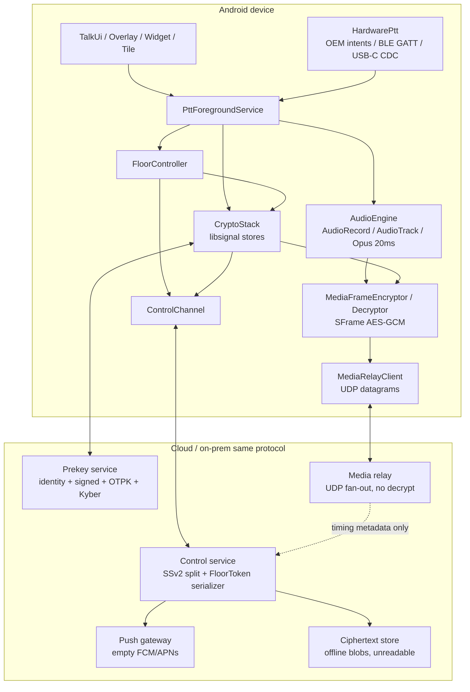
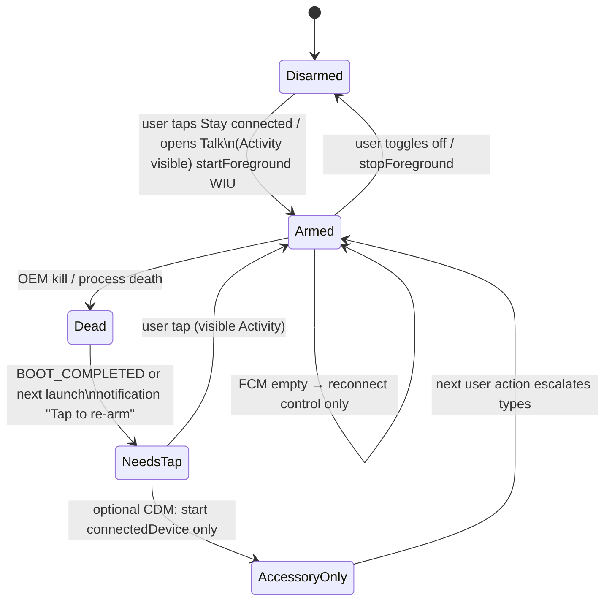
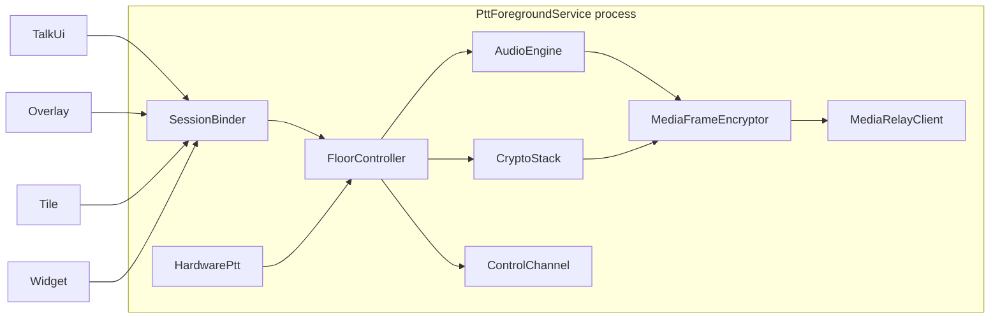
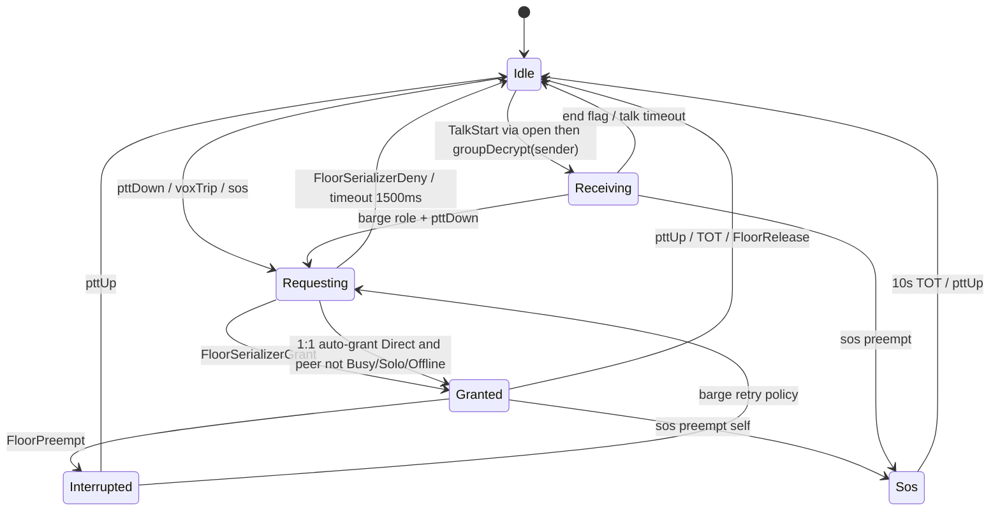

# Encrypted Broadband PTT — Product, Protocol, and Android Architecture

> **Historical design input.** This draft predates the implemented two-device,
> cross-platform, protocol 1.1 product and intentionally remains as an
> architectural decision record. It must not be used as the current feature
> list or release plan. See
> [`../docs/CURRENT_STATE.md`](../docs/CURRENT_STATE.md) and
> [`../docs/PROTOCOL_V1.md`](../docs/PROTOCOL_V1.md).

| Field | Value |
|---|---|
| **Document** | Encrypted broadband Push-to-Talk (PoC) design |
| **Author** | TBD |
| **Date** | 2026-08-23 |
| **Status** | Archived design draft; superseded by protocol 1.1 and current-state docs |
| **Workspace** | Historical greenfield design; product code now lives in this repository |
| **Companion research** | [`COMPETITIVE_ANALYSIS.md`](./COMPETITIVE_ANALYSIS.md) |
| **License posture (default)** | AGPLv3 for client + servers (see KD-1) |

---

## Overview

Zello 7.14.2 and ProPTT2 11.0.9 are internet walkie-talkies: hold a control, take a half-duplex **floor**, stream live compressed audio to a fan-out server, release. That radio loop is the product. Zello wins on presence, history, hardware PTT, and claimed channel scale (Work: 7k–10k concurrent). ProPTT2 wins on one-hand lock + A/B/C slots, video PTT, master/competitive floor, kiosk/provisioning, and Codec2. Both fail the same operational test: **still connected and able to play audio after hours in a pocket on cheap Android** (Doze, OEM killers, Android 14+ FGS types, Android 17 “must be foreground to play audio”). Neither ships Signal-grade E2EE as the default: Zello Work is TLS + AES-256 media with an org Message Vault that can break 1:1 E2EE; ProPTT2 is TLS + AES-128/ARIA-256 with optional E2EE.

This document specifies a **new stack** (not a Zello/IMPTTP clone): PQXDH + Double Ratchet + Sender Keys + Sealed Sender v2 for *warm* control; SFrame (RFC 9605) per-frame encryption of Opus **before** the relay; a dumb **UDP** fan-out that never sees plaintext (QUIC DATAGRAM is v1); and one Android session process that stays alive **after a user-visible arming tap**, not after `BOOT_COMPLETED`. Signal’s open-source libraries are first-class components, not a marketing analogy. PTT is **not** a Signal group call (~40 full-duplex participants with simulcast). Typical channel: one talker, many listeners, hold-to-talk, screen-off. We steal Signal’s **key agreement and frame encryption**, not RingRTC’s 40-person SFU topology.

---

## Background & Motivation

### Current state (from APKs and docs)

Competitive research snapshot:
[`COMPETITIVE_ANALYSIS.md`](./COMPETITIVE_ANALYSIS.md). The APKs, extracted
manifests, and vendor BLE tables used for the original review are not retained
in this repository. The design copied only a generic schema pattern, not a
vendor device list.

| | Zello `com.loudtalks` 7.14.2 | ProPTT2 `com.imptt.proptt` 11.0.9 |
|---|---|---|
| Native media | Opus, AMR, WebRTC, Vosk STT, NN VAD | Opus, Codec2 2.4 kbps, H.264/H.265, UVC |
| Transport | Proprietary UDP + TCP fallback; TLS control; AES-256 media (Work) | TCP+UDP+multicast; IMPTTP + SIP/RTSP |
| Floor | Default half-duplex; interrupt exists | Competitive queue, master, interrupt, SOS, TOT |
| Video | Photos only | Video PTT + FHD scene share |
| Stay-alive | `com.zello.ui.Svc` + `CallService`; FGS camera/location/mediaPlayback/mediaProjection/microphone | `PTTControllerService` + `PTTService`; FGS camera/connectedDevice/location/microphone; MusicService for “MP3 mode” |
| Hardware | 75 BLE JSON profiles, USB-C CDC 2-byte keycodes, dozens of OEM intents | Rugged/PoC intents, `ProPTT2.ini`, Wear |
| History | Local + Message Vault (cloud, 2y) | Local auto-delete; enterprise server recording |
| Offline | Queued channel messages (7.14, admin-gated beta) | “Full real-time” assumption; poor offline |

Shared radio model both apps implement (and we keep):

1. User holds PTT (on-screen, hardware key, BLE, VOX).
2. Client acquires a **floor lock** (one talker, with role exceptions).
3. Live compressed audio fans out in near real time.
4. Floor releases; history can be replayed.

### Pain points we are actually solving

1. **Pocket death is the deal-killer.** Zello 7.x release notes are mostly reconnect, overlay-stuck-in-receive, hardware PTT loops, and missed messages after lock. A new app that treats “alive after 8 hours on a cheap Samsung” as KPI #1 wins operations deals.
2. **Security is bolted on, then undone.** Org vaults and hop-by-hop media crypto (SRTP terminated at an SFU) look like encryption in a datasheet and are plaintext to the operator. Frontline workers (NY retail silent SOS is the canonical case in Zello’s own positioning) need E2EE that an admin cannot silently disable.
3. **The UX split is fake.** Users want Zello’s Talk / Recents / History **and** ProPTT2’s one-hand lock + slots. Nobody wants 80 settings activities or a user-facing “MP3 vs VoIP” toggle.
4. **Protocols are proprietary.** Cloning Zello’s UDP/TLS stack or IMPTTP is a legal and engineering trap. We specify a clean floor-control + SFrame-Opus-over-UDP protocol with published crypto.

### What we will not do

- Reverse-engineer Zello or IMPTTP into an interoperable clone.
- Make public social channels the homepage (Zello’s growth hack and moderation hole).
- Ship ProPTT2’s MusicService/MP3 half-duplex path (AudioRecord/AudioTrack only).
- Pretend a 10,000-member E2EE channel is MVP.

---

## Goals & Non-Goals

### Goals (MVP)

- Android-first voice PTT: **1:1 + channels**, hold-to-talk, live stream, half-duplex floor.
- Talker-to-hearer **< 400 ms** typical on good networks (Wi-Fi / solid LTE). Floor grant **< 150 ms** after PTT-down when already connected and sender keys are **warm** (SKDM finished at join). One control-stream round trip; see latency budget.
- Signal-grade E2EE as default: PQXDH session setup (`info = "PTT-PQXDH-v1"`), Double Ratchet (+ SPQR with **ML-KEM-768** braid when libsignal exposes it — not ML-KEM-1024), Sender Keys for channel control, Sealed Sender v2 on **warm** fan-out, SFrame on media. Relay cannot decrypt frames.
- Pocket stay-alive **after user-visible arming**: one long-lived `PttForegroundService` started from Talk / “Stay connected” while the app is in the foreground (WIU). Persistent session notification is the Android 17 play permit. Empty FCM wakes the **control socket only**; it does not start a `microphone` FGS. Post-reboot requires a tap to re-arm.
- Hardware / BLE PTT and overlay / widget / tile all bind to the **same** session. Accessory profiles are original JSON using Zello’s *field pattern*, not their 75-row table.
- Local encrypted history of each TX as a message. Offline: sender queue **and** server store-and-forward of ciphertext the server cannot read.
- Presence: Available / Busy / Solo / Standby / Offline (Zello semantics, minus public-channel discovery).
- In-channel network + audio meters (ProPTT2 status pane — users trust meters).

### Goals (v1 / v2 — designed now, not built in MVP)

| Wave | Scope |
|---|---|
| **v1** | Video PTT (same floor), on-device transcripts, silent SOS + 10 s priority TX + location, admin console, QR/MDM login, maps |
| **v2** | Scene share (FHD H.264/H.265, UVC), dispatch queue, on-prem same binary, RoIP gateway, Wear, kiosk/embedded flavor, Codec2 2.4 kbps degraded profile, Wi-Fi Aware mesh |

### Non-goals

- Interoperability with Zello Channel API, Zello Work, IMPTTP, ProGate, or MCPTT/3GPP MCS.
- Public/social channel directory as home.
- Full-duplex phone calls as the primary UX (optional 1:1 full-duplex is a later flag, not the radio model).
- Using RingRTC’s group-call SFU **as-is** for PTT scale.
- User-facing transport toggles (“TCP only”).
- Facebook login, GCM leftovers, Cast, `mips` / `armeabi` natives.
- Silently giving an org or the server plaintext audio (“Message Vault” without a visible extra recipient).
- Multi-device Sesame as MVP (single device per account in MVP; protocol leaves room).
- iOS in MVP (architecture must not block it).

### Quantitative targets (MVP)

| Metric | Target |
|---|---|
| Mouth-to-ear, good network | p50 < 300 ms, p95 < 400 ms |
| Floor grant, warm session | p50 < 80 ms, p95 < 150 ms (single control-stream RTT + local `groupEncrypt` + SSv2 seal) |
| SKDM after join (not PTT-down) | < 2 s on Wi-Fi for N ≤ 64; UI may show “getting floor…” only if the user PTTs before the join-time job finishes |
| Opus framing | 20 ms, 16 kHz NB default, 48 kHz when uplink ≥ 64 kbps |
| Jitter buffer | 40 ms target on good net, adaptive 20–120 ms; hold ≤120 ms of media until `unwrapMediaEpoch` |
| Channel membership (E2EE, MVP) | **64** hard cap (KD-13); 256 connected listeners is a v1 stretch with **chunked** SSv2, same membership crypto |
| Concurrent connected listeners per channel (media fan-out) | 256 MVP relay (12800 pps/channel at 50 pps); 2k v1; 10k is a v2 topology change |
| Pocket session | 8 h screen-off **after a foreground arming tap** on a mid-range Android 14+ device, still able to **play** the next TX. **Not** promised across reboot until OEM-tested. |
| Local history | 30 days or 1 GB, whichever first; SQLCipher |
| Prekeys on server | 100 one-time X25519 + 100 Kyber/ML-KEM one-time; replenish at 20 remaining |

---

## Key Decisions

### KD-1 — Ship AGPL and consume libsignal (default)

**Decision:** The client, control server, prekey server, and media relay are **AGPLv3**. We link [`libsignal`](https://github.com/signalapp/libsignal) (`org.signal:libsignal-android` + `libsignal-client`) for PQXDH, Double Ratchet, SPQR/ML-KEM Braid, Sender Keys, Sealed Sender, fingerprints, and store primitives.

**Rationale:** Reimplementing PQXDH+DR+SK from papers is legal-ish and easy to get wrong. The 2025 Double Ratchet session-confusion / decrypt-with-other-sessions attacks (Cheval, Jacomme, Richards; eprint 2026/727; libsignal fix ~March 2025) are exactly the class of bug a from-scratch ratchet hits. Pin PR1 to a libsignal build **after** that fix. Signal does not offer third-party commercial licenses; “use outside of Signal is unsupported.” AGPL is the honest cost of using the audited implementation.

**Fallback (product-legal veto):** Do **not** copy libsignal source. Implement PQXDH + Double Ratchet + Sender Keys from [signal.org/docs](https://signal.org/docs/) using RustCrypto, plus SFrame (RFC 9605), with an **external crypto audit gate** before any production traffic. RingRTC and Signal-Calling-Service are **not** required in either path; we are not adopting their SFU.

This remains an Open Question for counsel. Until answered, all code lands AGPL.

### KD-2 — New protocol; do not clone Zello or IMPTTP

No reverse-engineered opcode compatibility. On the wire, MVP is:

1. TLS (HTTP/2) **control** stream: opaque envelopes + `FloorToken` / `FloorSerializerGrant` (availability).
2. E2EE **FloorDecision** (sender-key) minted **only by the talker**, binding `{request_token, talk_id, tot_ms, media_epoch_kid}`.
3. UDP **media**: 20-byte routing header + SFrame (RFC 9605). QUIC DATAGRAM is v1 (KD-14).

### KD-3 — Steal UX, not chrome; video is a mode (product IA)

Talk / Recents / History (Zello) + one-hand lock and A/B/C slots (ProPTT2). Video PTT and scene share are modes on the same floor, not a second app. Public channels are not the homepage. **MVP RX mix:** one live play at a time, SOS > primary target > other connected channels (those go to history). v1 may mix two with ducking.

### KD-4 — Identity is a random ACI, not a phone number

Primary identifier: 16-byte UUID (`Aci`). Phone number is optional, not in the fingerprint, not required to register. Device id: `u32`, MVP always `1`.

### KD-5 — Control plane = Signal group messages; media plane = SFrame + dumb fan-out

- **Control** (`TalkStart`, presence, SOS, text, location, SKDM, `ProfileShare`): Sender Keys, one `DistributionId` (UUID) per channel **epoch**. Membership change **mints a new DistributionId** (do not call a non-existent `rotateOurKey()`; `GroupSessionBuilder.create` reuses state if a record exists).
- **Warm fan-out:** Sealed Sender v2, chunked ≤100 recipients or 96 KiB. Server **does** parse the SSv2 outer structure, **does** see the recipient mailbox set, and **does** know the sending mailbox on `/v1/control`. SSv2 is not sender-anonymity toward control.
- **Cold path (SKDM, first 1:1, missing keys):** identified send.
- **Media:** talker generates `Nk` random bytes as RFC 9605 `base_key`, wraps them in `MediaEpochAnnouncement`, encrypts Opus with SFrame **before** `MediaRelayClient`. Relay does not rewrite headers in MVP.

### KD-6 — PTT scale ≠ Signal group-call topology

RingRTC/Signal-Calling-Service target ~40 full-duplex video peers, ICE, SRTP, googcc, simulcast, RTP header rewrite. We implement a **PTT relay**: one talker, Opus 20 ms, optional FEC, no mixer, no transcode, no SRTP termination of E2EE. We **copy RingRTC’s two properties and a sender-relative 3 s grace** (`grace_ms`, not a Unix timestamp), not the SFU.

### KD-7 — Split hybrid floor (protocol locked; who serializes is provisional)

Fully private floor at 10k members and < 150 ms is a research problem. **On-wire split (locked):**

1. `FloorToken` / `FloorSerializerGrant|Deny` / `FloorRelease` on the TLS control stream — availability, TOT, preempt, **UDP teardown**. Cleartext `{channel_handle, request_token, priority_class, tot_ms, sender_demux}`. `sender_demux` is routing metadata (an SSRC), not identity. The serializer is **not** a talker identity. Control tells the relay `stop(channel_handle, sender_demux)` on release.
2. `TalkStart` (one sender-key plaintext: `FloorDecision` + `MediaEpochAnnouncement`) — **only the talker** `groupEncrypt`s after a grant, binding `{request_token, talk_id, tot_ms, media_epoch_kid, sender_demux}`. Listeners enter `Receiving` only after `open()` then `groupDecrypt(sender, …)` of `TalkStart`. They never treat server tokens as identity.

A compromised control server **can** grant the floor (availability) to any connected client and can drop messages (DoS). It **cannot** make listeners display a fake talker identity.

**Provisional (Open Question 5):** MVP Team/Duty/Ad-hoc serializer = control server. Dispatch (v1) = nominated device. Whether *all* channels use a nominated device is not locked.

### KD-8 — Org “Message Vault” is an extra recipient, or it does not exist

Default: no vault. Optional **compliance identity** is a normal linked device (or a dedicated always-on client) with a published identity key, `role=compliance`, listed in the member list and in the channel safety number. History blobs are addressed to that ACI **at TX time** using the epoch that created them — **never re-wrapped** to later members. The server never gets a media-epoch key. Who holds the private key (HSM vs dedicated app vs desktop daemon) is an ops choice; it is **not** the PTT server. Protocol is in MVP so extra members do not break clients; the Talk banner is v1 unless Open Question 3 says otherwise.

### KD-9 — zkgroup is v1, not MVP

MVP channel ACLs are server-visible membership lists (the server can authorize fan-out). We do **not** claim graph hiding until zkgroup-style membership credentials ship. Honest threat model > pretend privacy.

### KD-10 — Crypto and session before UI

PR order is PR0 skeleton → identity stores → sender keys/seal → draft proto → audio engine → FGS (from a tap) → hardware → UDP relay → Talk UI. A pretty lock button on plaintext Opus is a failed product.

### KD-11 — One session process; hardware never bypasses crypto

`PttForegroundService` owns audio, floor, crypto, sockets. Overlay, widget, tile, BLE, USB-C, OEM intents are **inputs** to `HardwarePtt` → `FloorController`. They cannot start a TX without (**`FloorSerializerGrant` or 1:1 local auto-grant**), plus a `TalkStart` (`FloorDecision` + media epoch). 1:1 auto-grant applies when the target is `TalkTarget.Direct` and the peer is not Busy/Solo/Offline; the 1500 ms timeout still fires if the peer never decrypts.

### KD-12 — minSdk 26, targetSdk 36, ABIs `arm64-v8a` + `x86_64`

Drop `armeabi` / `mips`. `armeabi-v7a` only if a named rugged SKU requires it (decision at v1). Notification channels, BLE GATT, and FGS types all exist at 26. Cheap Android in 2026 is 64-bit.

**Run-on-17 vs target-36:** Zello 7.14.2 *targets* 37. We target 36 and must still obey Android 17’s **running-on-17** rule: background audio requires a non-`SHORT_SERVICE` FGS (or a visible activity) regardless of `targetSdk` ([bg-audio](https://developer.android.com/about/versions/17/changes/bg-audio)). Targeting 36 only postpones the extra “FGS must be WIU-capable / started from a user-visible context” clause that applies when the app later targets API 37. KD-16 already starts the FGS from a user-visible context, so a future target bump does not redesign the arming flow.

### KD-13 — Channel cap: 64 E2EE members, 256 connected listeners (MVP)

Hard cap on sender-key membership is **64**. Relay fan-out may serve 256 connected devices (same 64 identities, multi-device later). v1 stretch 256 members uses **chunked SSv2**, not a single envelope. 7k Zello-Work-sized channels are v2 MLS (or we refuse the deal). Extra RX devices are **members** in the safety number (KD-8); there is no silent listen-only class.

### KD-14 — UDP media + TLS control in MVP

Android has no first-party QUIC DATAGRAM API. MVP media is **raw UDP** (padded to 160 B). Control is **HTTP/2 over TLS**. QUIC control streams and RFC 9221 DATAGRAM are v1. One relay binary: `server/relay` (Rust). There is no second `native/crates/ptt-relay`.

**UDP bind / accept / teardown (routing, not E2EE):**

1. Control issues a 32 B `demux_token` at session connect (not a media key).
2. Client **STUN-binds** to the minted relay address with `MESSAGE-INTEGRITY` over that token (HMAC-SHA1 as STUN, key = `demux_token`). Relay pins **UDP 5-tuple → `{mailbox_id, channel_handle}`**. Re-STUN on every network change (`CONNECTIVITY_ACTION` / `NetworkCallback`).
3. Relay **accepts media UDP only from a pinned 5-tuple**. A copied `sender_demux` from another IP/port is dropped (SFrame would fail closed anyway; this stops fan-out of garbage to 256 listeners).
4. Optional rebind without a second STUN: flags bit `HMAC8` — 8-byte truncated `HMAC-SHA256(demux_token, header[0:20] || sframe)` after the 20-byte header. Valid HMAC updates the pin. Default is off; STUN rebind is the primary path.
5. TLS `FloorToken` and `FloorRelease` carry `sender_demux` **in the clear**. Control calls relay `stop(channel_handle, sender_demux)` within 1 s of release. Residual: control and relay both see which demux is talking (they already see it in the UDP header).

### KD-15 — Single device per account in MVP

`device_id` is always `1`. Sesame multi-device is a later protocol addition, not an MVP store shape.

### KD-16 — Session FGS starts only from a user-visible arming action

`BOOT_COMPLETED` **must not** start `microphone` (API 34+) or `mediaPlayback` (API 35+) FGS — both throw `ForegroundServiceStartNotAllowedException` at `targetSdk 36`. High-priority FCM’s FGS-start exemption lasts seconds and still cannot *create* a while-in-use `microphone` FGS from the background.

Arming: user turns “Stay connected” on (or opens Talk) while an Activity is visible → `startForegroundService` with `microphone|mediaPlayback|connectedDevice`. After reboot or OEM kill: notification / full-screen intent **requires a tap** to re-arm. Optional: start **only** `connectedDevice` from boot if a Companion Device Manager association exists (`REQUEST_COMPANION_START_FOREGROUND_SERVICES_FROM_BACKGROUND`), then escalate types after the next user action. Degraded state: **process killed → RX may recover after tap; hardware TX does not.** Empty FCM reconnects control / drains mailbox; it never starts the mic FGS. The 8 h pocket KPI is measured **from the arming tap**, not across reboot, until Samsung A-series / Xiaomi / Oppo soaks say otherwise. Open Question 10 (always-on mic vs PTT-down-only mic for Play) is still a policy call; it does not restore boot-to-mic.

---

## Proposed Design

### Product shape

Three surfaces, one session (steal Zello IA + ProPTT2 radio, clone neither):

1. **Talk** — one primary target (channel or 1:1), giant PTT, speaker/ear, battery/network meters, “who’s talking”, TOT. Optional A/B/C slot rail for radio users (hidden by default for contact-first users). Hardware key and BLE work screen-off **while the session is armed**.
2. **Recents** — missed TX, failed floor, SOS, presence changes. Inbox, not a social feed.
3. **History** — each TX is a message: talker (local identity), duration, optional transcript (v1), location, epoch-bound encrypted audio blob. Search comes with transcripts in v1.

**Multi-channel RX (MVP):** the session may be *connected* to several Team/Duty channels (Zello-like), but `AudioEngine` plays **one live RX at a time**. Priority: SOS > primary Talk target > any other connected channel. Lower-priority live audio is not mixed; it is written to history. Persistent notification shows the one live talker (name from local decrypt). v1: mix two with ducking. This is a product rule, not a crypto rule.

Channel types (MVP subset of Zello’s model, minus public/social):

| Type | Semantics |
|---|---|
| **Team** | Always-on; members are auto-contacts; connected while session is up |
| **Duty** | Join for a shift; leave rotates media epoch |
| **1:1** | Contact; auto-grant floor unless Busy/Solo |
| **Ad-hoc** | Created from a contact set; dies when last member leaves |
| **Dispatch** (v1) | Queue → 1:1 with dispatcher; nominated floor manager |

Roles: `talk`, `listen`, `barge` (interrupt), `dispatch`, `emergency-target`. Default half-duplex. Optional barge-in is a role, not a mystery.

Presence (Zello semantics we keep): **Available / Busy / Solo / Standby / Offline**. Solo dumps others to history and mutes live RX. Standby is connected-but-quiet (session up, no speaker ducking). Server stores presence on **mailbox_id**, not ACI (see data model). E2EE presence payloads (display name, status text) are sender-key encrypted; the mailbox heartbeat `{mailbox_id, status_class, last_seen}` is identified metadata.

### Repo layout (so PR1 has a home)

Workspace is research-only today. Product code lands here:

```
/home/golanbenoni/ptt/
  research/                          # existing competitive work
  LICENSE                            # AGPLv3
  gradle/libs.versions.toml          # pinned libsignal + hashes (PR0)
  proto/
    control.proto                    # FloorToken, FloorDecision, SKDM, media-epoch
    media.proto                      # on-wire UDP media header (unencrypted routing)
  native/
    Cargo.toml                       # workspace (sframe-ptt, audio-engine ONLY)
    crates/sframe-ptt/               # RFC 9605 encrypt/decrypt + grace_ms
    crates/audio-engine/             # Opus, jitter, VAD; JNI
  android/
    settings.gradle.kts              # empty modules in PR0
    crypto/                          # :crypto AAR — libsignal stores + CryptoStack
    session/                         # :session — PttForegroundService
    audio/                           # :audio — AudioEngine JNI
    floor/                           # :floor
    media/                           # :media — SFrame JNI + UDP MediaRelayClient
    control/                         # :control — ControlChannel
    hardware/                        # :hardware
    app/                             # Talk/Recents/History (late PRs)
  server/
    prekey/                          # bundles, one-time prekeys, sender certs
    control/                         # SSv2 split, floor serializer, mailbox
    relay/                           # UDP fan-out (the only relay binary)
    push/                            # empty FCM
  .github/workflows/ci.yml           # PR0: compile empty modules
```

### System architecture



Trust boundary: everything left of the cloud subgraph is E2EE **content** (inner protobuf, SFrame, media keys, Opus). Cloud boxes **always** know the sending `mailbox_id` (hence ACI, via `accounts`) for every `FloorToken`, heartbeat, and envelope on the authenticated `/v1/control` stream. They also see timing, size, priority class, `sender_demux`, pinned UDP 5-tuples, and the SSv2 **recipient** mailbox set. SSv2 does **not** hide the sender from control; it means stored mailbox blobs are not labeled `From: ACI` and envelope-byte logs must not print ACI. There is **no** unidentified submit RPC in MVP. Listeners never treat `FloorSerializerGrant` as a talker identity.

### Signal crypto → PTT component map

This section is the product. Each capability maps to a concrete module, not “inspired by Signal.”

#### 1. Identity

| Signal primitive | PTT mapping |
|---|---|
| Identity keypair (**X25519 + XEdDSA**, not a separate Ed25519 identity) | Generated on first launch in `CryptoStack.generateIdentity()`. Private key in Android Keystore-wrapped SQLCipher (`:crypto` stores). |
| ACI | `Aci` UUID v4, server-assigned at register. **Not** a phone number. Tests use `debugSetAci`. |
| Profile key | 32 random bytes per ACI. Source of the 1:1 **unidentified-access key** (UAK) for recipient-side `open()` and a **future** unidentified RPC (not MVP). Shared 1:1 on first identified DR message. **Channel-scoped UAK:** `channel_secret` (32 B) held by members, rotated on join/leave/kick, distributed as sender-key `ProfileShare`. This is **not** the display-name string. |
| Prekey bundle | Identity, signed prekey, one-time X25519 prekeys, Kyber/ML-KEM-1024 prekeys (PQXDH). HKDF `info` = `"PTT-PQXDH-v1"` (ASCII, ≥8 bytes, spec §2.1). Published to `server/prekey`. |
| Safety numbers | 1:1: libsignal `NumericFingerprintGenerator` (5200 iterations). Channel: versioned fingerprint — `ver=0x01 \|\| channel_id \|\| concat(sort(member_identity_keys))`, SHA-512, interpret as an unsigned big-endian integer modulo `10^60`, left-pad to 60 decimal digits, then group 12×5; **recomputed on membership change**. Test vectors in PR2. New member **must** surface “channel safety number changed” before they hear live audio (user can tap-through; orgs can require verify). |
| Usernames | v1. MVP display name is a local profile string encrypted to the channel, not an identifier and not the profile key. |
| PIN / SVR / account-keys | Out of MVP. If we need key backup, use libsignal SVR primitives rather than inventing a recovery questions scheme. |
| SPQR / ML-KEM Braid | Optional continuing PQ ratchet when libsignal exposes it. Braid uses **incremental ML-KEM-768**, not ML-KEM-1024 (that size is PQXDH only). |

Registration flow:

1. Client generates identity keypair + 32-byte profile key + 100 OTPK + 100 Kyber prekeys + signed prekey.
2. HTTPS register: `POST /v1/register` with a registration token (QR, MDM, email-otp — **not** SMS-as-identity). Server returns `Aci`. Client calls `debugSetAci` / `setAci` (the same setter; named `debugSetAci` in tests).
3. Client uploads bundle. Server stores public material only. Client uploads `uak_hash = SHA-256(UAK)` for a **future** unidentified path; MVP `/v1/control` is always device-authenticated and does not consult `uak_hash` to accept envelopes.
4. Client fetches a **sender certificate** (24 h TTL, refresh at 12 h) binding ACI ↔ identity key, signed by the pinned server cert.
5. Optional phone binding is an attribute, never the primary key.

#### 2. 1:1 PTT

Session: **PQXDH** ([spec](https://signal.org/docs/specifications/pqxdh/)) then **Double Ratchet** ([spec](https://signal.org/docs/specifications/doubleratchet/)). When libsignal’s session implements **SPQR / ML-KEM Braid** ([spec](https://signal.org/docs/specifications/mlkembraid/)), we take it for post-quantum **continuing** secrecy, not just the initial handshake (harvest-now-decrypt-later). SPQR ≠ PQXDH: handshake is ML-KEM-1024; braid is ML-KEM-768.

- Floor and media-epoch wrap travel as Signal messages (`SessionCipher.encrypt`). First 1:1 is **identified** (no `SessionRecord` yet → SSv2 cannot run). Subsequent 1:1 may SSv2-wrap the **mailbox blob** so dumps are not labeled `From: ACI`; control still knows the sending mailbox on `/v1/control`.
- 1:1 floor is **local auto-grant** unless peer is Busy/Solo/Offline (then queue locally like Zello 7.14). `FloorController`: `Requesting → Granted` on that auto-grant — **no** server `FloorSerializerGrant`. The talker still sends a DR `TalkStart` so the peer has `{talk_id, media_epoch_kid}`. Hardware/overlay PTT on a Direct target uses this transition (KD-11).
- Media: talker generates `Nk` **random** bytes as RFC 9605 `base_key` (`Nk=16` for suite `0x0004`). **Do not** pre-HKDF; SFrame `derive_key_salt` does `"SFrame 1.0 Secret key" || KID || suite` itself. The first DR payload is `TalkStart`. Then UDP SFrame frames from a STUN-pinned 5-tuple.
- SFrame AAD is **exactly 36 bytes**: `channel_id` (16) || `talk_id` (16) || `sender_demux` (4). 1:1 uses pairwise synthetic `channel_id = UUID v5(ns, sort(aci_a, aci_b))`. PR2 golden vector freezes this encoding.
- Receiver **buffers ≤120 ms** of UDP until `unwrapMediaEpoch` succeeds; then plays. Frames that arrive with unknown `kid` wait in that hold queue or drop.
- Relay does not need the ACI; it needs `dest_demux` minted at session start. `kid` is a random 64-bit unique per TX (never reused). `sender_demux` is a random `u32` unique among currently connected senders on that relay (relay rejects collisions).

#### 3. Channel (1:N) PTT

**Control plane — Sender Keys** (libsignal `GroupSessionBuilder` / `GroupCipher`):

- One `DistributionId` (UUID) per channel **epoch**. Membership change (join/leave/kick/role change) **mints a new DistributionId** and increments `epoch`. There is no `rotateOurKey()` in libsignal; `GroupSessionBuilder.create(sender, distributionId)` **reuses** stored state if a record exists. Rotation = new UUID + `create()` + SKDM.
- **SKDM is a join-time job, not a PTT-down job.** For Team/Duty, on join (and on epoch bump): every member who already has a send capability runs `create()` on the new `DistributionId` and 1:1-delivers `SenderKeyDistributionMessage` to each current member not in `sender_key_shared`, in parallel, via `POST /v1/prekeys/batch` (max 64) and a worker pool. SKDM **must be identified send** — SSv2 requires an existing `SessionRecord`; the bootstrap *is* that session. SLO: SKDM complete **< 2 s after join on Wi-Fi**, not after PTT-down. Members who have never sent skip until first talk; their **presence** is then undecryptable until that first talk (accept this; UI shows them as “joined, keys pending”).
- Subsequent `TalkStart`/presence/SOS/text/location: **one** `groupEncrypt`, then SSv2 fan-out of the same ciphertext (warm path). Envelopes still ride the **authenticated** control stream (control knows the sender mailbox).

**Sealed sender (honest about the authenticated stream):**

MVP has **no unidentified submit RPC**. `/v1/control` is a long-lived HTTP/2 TLS stream authenticated as a device. Control **always** knows `mailbox_id` → ACI for FloorToken, heartbeats, and every envelope. Rate-limit by **mailbox** on that stream (5 FloorTokens/s, envelope caps). That is the anti-abuse control.

SSv2 is still used, for two properties only:

1. Stored mailbox blobs are **not** labeled `From: ACI` (a mailbox dump does not print the sender).
2. Logs of envelope **bytes** must not print ACI.

UAK/cert remain so recipients can `open()` (sender cert → `DeviceId`) and so a future unidentified path can be added without a protocol break.

1. **UAK.** Account UAK = `HMAC-SHA256(profile_key, "PTT-UAK-v1")[0:16]`. **Channel-scoped UAK** = `HMAC-SHA256(channel_secret, "PTT-CH-UAK-v1")[0:16]`. Members learn `channel_secret` from sender-key `ProfileShare` at join. Server may store `SHA-256(account UAK)` for a future unidentified RPC; MVP accept path does not use it.
2. **Sender certificate.** Server-issued, 24 h TTL, binds ACI + identity key + device_id=1, signed by the pinned control CA. Recipients verify the cert inside the sealed envelope (`open()` returns that sender). Refresh at 12 h.
3. **SSv2 encrypt** only when a `SessionRecord` exists for every recipient in the batch. **Identified fallback is mandatory for SKDM bootstrap, first 1:1, missing keys, expired cert.** `seal` returns those recipients as `identifiedFallback: List<DeviceId>`.
4. **Chunking.** ≤100 recipients or 96 KiB. N=64 is one envelope. 7k is N envelopes. **MLS does not remove recipient-set metadata.**
5. **Server view.** Control parses the SSv2 **outer** to split per mailbox. It sees the recipient set **and** the sending mailbox. Inner protobuf stays opaque.
6. **`CryptoStack.seal` / `open`.** `open` returns `Opened(sender, inner)`. Channel path: `groupDecrypt(opened.sender, channel, opened.inner)`.
7. **Kick/leave UAK rotation.** On kick or leave, remaining members mint a new `channel_secret`, sender-key `ProfileShare` it to the new membership set, and drop the leaver’s account UAK from the channel share list. Until that job finishes, a kicked device still cannot submit envelopes except on **its own** authenticated stream, which ACL + mailbox rate limits reject for that `channel_handle`. Do not claim pairwise delivery tokens are revoked before `ProfileShare` lands.

**Media plane — not sender keys, not RingRTC SFU:**

PTT has one talker. The talker:

1. Generates `MediaEpoch { kid = random u64, base_key = Nk random bytes, cipher_suite = 0x0004 }` and a `sender_demux` (relay-unique `u32`).
2. After `FloorSerializerGrant` (or 1:1 auto-grant), `groupEncrypt(TalkStart{FloorDecision, MediaEpochAnnouncement})` — **one** sender-key plaintext, one SSv2 fan-out.
3. STUN-binds if the 5-tuple is not pinned, then encrypts each 20 ms Opus packet with SFrame **before** `MediaRelayClient.send()`, AAD = 36-byte `{channel_id, talk_id, sender_demux}`.
4. Relay accepts UDP only from the pinned 5-tuple and fans it out. No mixer. No transcode. No header rewrite.
5. Listeners **must not play** until `open()` + `groupDecrypt(sender, …)` yields a `TalkStart`. Hold ≤120 ms of UDP; then drop.

**Join/leave during an active TX — RingRTC rules** ([How to build encrypted group calls](https://signal.org/blog/how-to-build-encrypted-group-calls/)):

> Property 1: Someone who has not joined must not decrypt media from before they joined.  
> Property 2: Someone who left must not decrypt media from after they left.

Rules we adopt:

1. On join or leave, the **current talker** (only — PTT simplification vs every RingRTC client) mints a new `DistributionId` + new media epoch, identified-SKDMs it to the **new** membership set, sender-key-wraps a new `TalkStart` (joiner can decrypt E2, not E1), and **starts using E2 after `grace_ms` (default 3000) on the sender’s monotonic clock**. Receivers keep E1 until they see frames with the new `kid` (plus a 200 ms hold). **Do not key crypto transitions on Unix wall time.**
2. The joiner does not receive the old epoch key. History blobs are never re-wrapped (below).
3. **Every member who already has a sender key** SKDM-syncs the joiner within the same 3 s window (join-time job, identified, parallel). If they miss it, presence/floor from X decrypts only after X’s next talk.
4. **On kick/leave:** remaining members also rotate `channel_secret` and `ProfileShare` it (channel-scoped UAK). The leaver is omitted. Until `ProfileShare` lands, ACL on the authenticated sender mailbox is the only ban on their submits.

PTT simplification vs RingRTC: listeners do not hold send-media keys. A listener becomes a talker only after `FloorSerializerGrant` **or 1:1 auto-grant**, at which point join-time SKDM should already have made them warm.

**Scale honesty:** Sender-key **distribution** is O(N) 1:1 wraps. Group **encrypt** is O(1). SSv2 fan-out is O(N) in **server-visible recipient set**, chunked. MVP N ≤ 64 (KD-13). A 7k-member Zello Work channel cannot be “full member-set E2EE sender keys” without MLS/TreeKEM (v2). Extra receivers are members in the safety number; we do **not** invent a silent listen-only class (conflicts with KD-8).

#### 4. Floor control vs metadata

`FloorController` states: `Idle | Requesting | Granted | Receiving | Interrupted | Sos`.

Priority (total order, ProPTT2-inspired): **SOS > dispatch > master/barge > normal**. TOT is mandatory for normal (default 30 s, admin-set, shown on Talk UI). TOT clock is the **sender’s `elapsedRealtime`**, not wall clock; serializer TOT is advisory. Master/dispatch can be configured without TOT. Competitive mode (v1): grant queues the next `request_token`. Rate limit: **5 FloorTokens/s per mailbox per handle**, **20/s per handle**.

**Who serializes (availability only):**

| Channel type | Floor serializer |
|---|---|
| 1:1 | Auto-grant at the two clients; no server decision |
| Team / Duty / Ad-hoc | Control server (MVP). Open Question 5 may move this to a nominated device. |
| Dispatch (v1) | Nominated dispatcher **device**; server is transport |

Two on-wire messages (KD-7). Listeners **never** treat (1) as identity.

```
# (1) TLS control stream — availability + UDP routing. Server can mint grant/deny.
FloorToken {
  channel_handle: opaque 16B,
  request_token: 16B random,      // minted by talker
  priority_class: u8,             // 0 normal, 1 barge, 2 dispatch, 3 SOS
  tot_ms: u32,
  sender_demux: u32,              // CLEARTEXT routing (SSRC). Residual metadata.
}
FloorSerializerGrant { request_token, tot_ms }
FloorSerializerDeny   { request_token, reason }
FloorRelease {
  channel_handle: 16B,
  request_token: 16B,
  sender_demux: u32,              // control → relay stop(handle, demux)
}

# (2) E2EE, only the talker groupEncrypts this after grant. Server cannot.
# Wire type is TalkStart, not a concatenation of two messages.
FloorDecision {
  request_token: 16B,             // binds to (1)
  talk_id: UUID,                  // minted by talker, never by server
  tot_ms: u32,
  media_epoch_kid: u64,
  sender_demux: u32,              // same value as (1), for listeners
}
```

`talk_id` is **talker-minted**. Capture starts on PTT-down and buffers. Media UDP is sent only after `FloorSerializerGrant` **or 1:1 auto-grant**, and only from a STUN-pinned 5-tuple. Listeners play only after `TalkStart` decrypts. Buffer media until unwrap (≤120 ms).

On `FloorRelease`, control calls relay `stop(channel_handle, sender_demux)` within 1 s. Control does **not** parse E2EE `FloorDecision` to learn demux — it uses the cleartext field on the TLS token/release.

**Compromised control server:** can always grant availability to a connected client, preempt, drop envelopes, `stop()` the wrong demux, or map mailbox → ACI (it already has that). It **cannot** produce a sender-key `TalkStart`, so it cannot make listeners display a fake talker identity or decrypt/forge audio.

**Residual metadata:** the server sees the **sending mailbox_id → ACI** for every control-stream frame, `priority_class` (including **SOS = 3**), `sender_demux`, packet timing, pinned 5-tuples, and the SSv2 recipient mailbox set. Padding keepalives (fixed-size, jittered 15–45 s) reduce “talking vs idle” a little; they do not defeat a global passive relay. If SOS must be private, encrypt `priority_class` and give preempt to a nominated-device manager (already the dispatch option) — that is Open Question 5, not a silent change.

**Do not** put inner floor identity on a path that must decrypt E2EE at the server.

#### 5. Offline / history

Two queues, both ciphertext. **One history primitive:**

> Store `MediaEpochAnnouncement || concatenated SFrame frames` under the **epoch that created them**. Never re-wrap old media to new members.

That is Property 1/2 for the Recents/History surface. Late joiners cannot decrypt E1 blobs; they must not try with the new sender key. The server may still **store** blobs they cannot read (membership-gated GET returns 403/empty for epochs the client was not in — MVP may return the bytes anyway; the client will fail SFrame and skip).

File-key wrap of an Opus container is **export only**, and only to a vault recipient who was in the membership set **at record time**. It is not the store format.

1. **Sender queue** (Zello 7.14 behavior): if ControlChannel or relay is down, `FloorController` still records locally (user hears the TX sidetone), stores the epoch-bound blob in SQLCipher, retries. UI: “Queued — will send when connected.”
2. **Server store-and-forward:** control accepts envelopes addressed to offline members’ mailboxes (Signal async model). Media of a missed live TX is **not** re-streamed live; it lands as that same epoch-bound blob. Server cannot read it.

**Compliance vault (KD-8, operational):**

| Question | Answer |
|---|---|
| What is it? | A normal linked device **or** a dedicated always-on client with a published identity key, `role=compliance` |
| Private key | Held by that client (HSM / dedicated app / desktop daemon). **Not** the PTT server |
| Online? | Must be in the membership set **at TX time**. If offline, it still gets the history blob in its mailbox (store-and-forward). Live RX is lost while down; history is not |
| Retention | 30 days default, org-configurable. Zello’s 2 years is not our default |
| Protocol vs UX | Role + rotation + no re-wrap ship in PR10 so MVP clients do not break on an extra member. Talk banner is PR15 unless Open Question 3 promotes it |

Local DB: SQLCipher, DB key in Android Keystore (`AES256-GCM`, `setUserAuthenticationRequired(false)` for screen-off RX — otherwise we cannot decrypt history or sender keys while locked, which breaks the radio). This is a **stolen-device** tradeoff: screen lock does not lock an **armed** radio session. Mitigate with: optional user-auth for app open, remote wipe via control message, and short sender-key lifetime on shared devices.

#### 6. zkgroup / private groups

[Signal private group system](https://signal.org/blog/signal-private-group-system/) uses zkgroup membership credentials so the server can authorize “this client is in the group” without a plaintext roster.

- **MVP:** server has a membership table `(channel_id, aci, role)`. Media relay is authorized by a short-lived `demux_token` issued at connect. **The server knows the social graph of channels.** Do not advertise otherwise.
- **v1:** zkgroup (libsignal `org.signal.libsignal.zkgroup`) membership proofs for control and relay auth; encrypted group blobs for title/avatar/members. Prekey server still sees “this ACI uploaded keys.”
- **v2:** sealed sender + zkgroup + padding so the control server’s view is closer to Signal’s.

#### 7. Push / background

FCM/APNs payload is **zero bytes**. Purpose: wake the process so `ControlChannel` reconnects and drains the mailbox — **not** to start a `microphone` FGS, not to display a transcript, not to carry an epoch announcement (FCM ~4 KB is also the wrong size). High-priority FCM’s FGS-start exemption lasts **seconds**, not a shift, and still cannot create a while-in-use `microphone` FGS from the background (KD-16).

**User-visible arming (the only legal way to get a radio FGS at targetSdk 36):**



Android constraints (this is the Zello changelog, absorbed rather than wished away):

- **Android 14 (API 34) + `targetSdk 36`:** `microphone` FGS **cannot** be started from `BOOT_COMPLETED` (`ForegroundServiceStartNotAllowedException`). While-in-use types generally cannot be *created* while the app is backgrounded.
- **Android 15 (API 35)+:** `mediaPlayback` FGS **cannot** be started from `BOOT_COMPLETED` either.
- **Android 17, all apps running on 17** regardless of `targetSdk`: playback needs a non-`SHORT_SERVICE` FGS or a visible activity ([bg-audio](https://developer.android.com/about/versions/17/changes/bg-audio)). If we later target 37, that FGS must also be WIU-capable — which KD-16 already is.
- Types on `PttForegroundService` **once armed from the UI**: `microphone | mediaPlayback | connectedDevice`.
  - `microphone` — while the session is armed for TX (including screen-off hardware PTT). Play justification: “live two-way radio, user-started.” Open Question 10 may restrict this type to actual PTT-down; that does not restore boot-to-mic.
  - `mediaPlayback` — RX while not recording. **Not** a MediaSession/music player. AudioTrack lives in the session process. The type is the OS play permit.
  - `connectedDevice` — while a BLE or USB accessory is bound (ProPTT2 declares this; Zello 7.14.2 does **not**). **Not** on the BOOT_COMPLETED ban list; may be started from boot only with a Companion Device Manager association (`REQUEST_COMPANION_START_FOREGROUND_SERVICES_FROM_BACKGROUND`). That yields accessory events, not mic/RX, until the user escalates.
- `camera` / `location` types are **not** on the session service. Short-lived typed FGS for video PTT (v1) and SOS location (v1).
- `RECEIVE_BOOT_COMPLETED` posts “Tap to re-arm radio” (or CDM `connectedDevice` as above). It does **not** call `startForeground` with `microphone` or `mediaPlayback`.
- `REQUEST_IGNORE_BATTERY_OPTIMIZATIONS` + OEM guides (Samsung/Xiaomi/Oppo). Soak tests (PR7b) start from a foreground tap.

**Degraded TX (print in Talk and in the session notification):**

| Situation | RX | Hardware / overlay TX |
|---|---|---|
| Armed, process alive | Live | Live |
| Process killed, FCM arrives | Control reconnects; **no play** until tap re-arms FGS | **No** |
| After reboot, before tap | No | No |
| `connectedDevice` only (CDM boot) | No | Events queued until arm; then TX |

Keepalive: TLS ping jittered 15–45 s while Doze; shorter (5 s) while a TX is active. If UDP is blocked, media fails over to a TLS control-stream **is not** in MVP (call it out as degraded: “voice unavailable on this network”). Control itself is already TLS.

#### 8. Hardware PTT

Accessory JSON shipped as `android/hardware/src/main/assets/accessories/ble.json`. Schema fields follow Zello `research/extracted/zello/assets/ble/list.json` (`name`, `buttonService`, `buttonCharacteristic`, `buttonMode`, `automaticallyAddButton`, `preferSPP`) plus our `id` / `map`. **Content is original** — we do not ship Zello’s 75-row table. The BlueParrott example below is ours.

Our schema extends Zello’s with **actions** that only emit `HardwareEvent`s:

```json
{
  "id": "blueparrott.s450",
  "name": "BlueParrott S450",
  "transport": "ble",
  "service": "0000ffe0-0000-1000-8000-00805f9b34fb",
  "characteristic": "0000ffe1-0000-1000-8000-00805f9b34fb",
  "mode": "press-release",
  "map": [
    {"raw": "0x01", "event": "ptt_down"},
    {"raw": "0x00", "event": "ptt_up"},
    {"raw": "0x02", "event": "sos_down"}
  ]
}
```

USB-C CDC: documented 2-byte keycode protocol (PTT, SOS, replay, channel next/prev, status). OEM broadcast intents: a **device pack** maps `android.intent.action.PTT.down/up`, `com.sonim.intent.action.PTT_KEY_DOWN`, `com.symbol.button.L2`, etc. to the same `HardwareEvent`. We do **not** hardcode 50 receivers the way both competitors do in their manifests (`research/extracted/zello_manifest.json` intent_actions, ProPTT2 likewise).

Invariant: `HardwarePtt` → `FloorController.pttDown()` → crypto. No native path from a GPIO to `AudioRecord` that skips `CryptoStack`.

---

### Protocol

#### Transports

| Plane | MVP | v1 |
|---|---|---|
| Control | HTTP/2 over TLS 1.3, one bidirectional stream per session (`/v1/control`) | QUIC (HTTP/3) streams |
| Media | **Raw UDP**, 20-byte header + SFrame, padded to **160 B** | RFC 9221 QUIC DATAGRAM (library TBD: Quinn or quiche — not Cronet) |
| Prekeys / register | HTTPS | — |
| Push | FCM high-priority, **zero payload** | — |

NAT: STUN binding with `MESSAGE-INTEGRITY` over `demux_token`; relay pins 5-tuple → `{mailbox_id, channel_handle}`. Re-STUN on network change. No full ICE. Client JNI talks Android `DatagramSocket` (or rust `socket2` via the audio/media JNI). **One relay binary:** `server/relay`. Relays 256 listeners × 50 pps = 12 800 pps/channel; PR9 measures bind, pin, and reject-from-other-tuple.

If UDP is blocked: control stays up; Talk shows “voice unavailable”; TX queues as history blobs (offline path). No user-facing “TCP only” toggle.

#### Control messages (`proto/control.proto`)

Logical types (inner payloads sender-key or DR encrypted unless noted):

| Type | Direction | Encrypted with | Outer |
|---|---|---|---|
| `PreKeyBundleQuery` / `PreKeyBundle` | client ↔ prekey svc | TLS only (public keys) | identified HTTPS |
| `SenderKeyDistribution` | member → members (1:1) | DR session | **identified** (bootstrap) |
| `ProfileShare` | members → remaining members | Sender key | authenticated stream; rotates `channel_secret` |
| `TalkStart` | talker → channel | Sender key (one plaintext) | SSv2 wrap of mailbox blob |
| `MediaEpochAnnouncement` | nested in `TalkStart` | — | not sent alone |
| `FloorDecision` | nested in `TalkStart` | — | not sent alone |
| `FloorToken` / `FloorSerializerGrant` / `Deny` / `FloorRelease` | client ↔ serializer | TLS only | identified as mailbox; includes `sender_demux` |
| `Presence` (E2EE body) | member → channel | Sender key | SSv2 if warm |
| `MailboxHeartbeat` | client → control | TLS | identified; keys Redis |
| `SosAlert` | member → emergency channel | Sender key | SSv2 if warm; token `priority_class=3` |
| `HistoryBlob` | sender → offline mailbox | DR (1:1) or sender key, **epoch-bound** | identified or SSv2 |
| `Text` / `Location` / `Image` | member → channel | Sender key | SSv2 if warm |
| `MemberJoin` / `Leave` / `Kick` | admin → channel | Sender key; server ACL updated separately | SSv2 if warm |

`TalkStart` is the **single** sender-key plaintext of a TX (critical interface). Do not concatenate two protobufs on the wire.

```
message TalkStart {
  FloorDecision decision = 1;
  MediaEpochAnnouncement epoch = 2;
}

message FloorDecision {
  bytes request_token = 1;       // 16B, binds serializer grant
  bytes talk_id = 2;             // UUID, talker-minted
  uint32 tot_ms = 3;
  uint64 media_epoch_kid = 4;
  uint32 sender_demux = 5;
}

message MediaEpochAnnouncement {
  bytes channel_id = 1;          // UUID (16)
  bytes talk_id = 2;             // UUID (16), same as FloorDecision
  uint32 epoch = 3;
  uint64 kid = 4;                // random u64, unique per TX
  bytes sframe_base_key = 5;     // Nk random bytes; 16 for 0x0004
  uint32 cipher_suite = 6;       // 0x0004 = AES_128_GCM_SHA256_128
  uint32 grace_ms = 7;           // sender-relative; default 3000; 0 = now
  uint32 sender_demux = 8;       // matches media header; relay-unique u32
  uint32 tot_ms = 9;
}
```

SFrame `base_key` length **is** `Nk` (16 for MVP suite). RFC 9605 `derive_key_salt` runs on the receiver; we do not double-HKDF. **AAD is 36 bytes:** `channel_id` (16) || `talk_id` (16) || `sender_demux` u32 BE (4). PR2 includes a golden vector. Persist `(kid, counter)` with `fsync` before the first encrypt after process start (R9).

#### Media header (`proto/media.proto` — **unencrypted**, routing only)

```
# 20-byte header + SFrame frame [+ optional 8-byte HMAC]
#  0: version (1)
#  1: flags (FEC, start, end, keyframe-for-video, HMAC8=0x10)
#  2-5: sender_demux u32 BE
#  6-9: seq u32 BE
# 10-13: timestamp_rtp u32 BE   # 48 kHz units even if NB
# 14-15: payload_type          # 0 = sframe-opus-20ms
# 16-19: talk_id_hash          # first 4 bytes of talk_id, collision-ok for RX filter
# 20+: SFrame (RFC 9605) wrapping one Opus packet
# if HMAC8: 8-byte HMAC-SHA256(demux_token, header[0:20] || sframe)[0:8]
```

**Accept path:** drop unless source 5-tuple is pinned (or HMAC8 verifies, then update pin). **MVP: relay does not rewrite seq.** Receiver dedups on `(sender_demux, seq)`. `MediaFrameDecryptor` replay window = **64** counters; older frames drop. `sender_demux` collision at the relay is a hard reject (mint another). Teardown: `stop(channel_handle, sender_demux)` from control on `FloorRelease`.

SFrame suite MVP: **AES_128_GCM_SHA256_128** (Nk=16, Nn=12, Nt=16). Voice frames are ~40–80 bytes; pad the UDP datagram to 160 B (header + SFrame + zeros) so length does not leak bitrate. AES_256_GCM_SHA512_128 is a compile-time flag, not a user setting.

Opus: 20 ms, VoIP mode, FEC on, DTX off for PTT (DTX fights VAD/open-mic detection). Bitrate 16 kbps default, 8–48 kbps adaptive. PLC at the decoder, not the relay.

#### Latency budget (400 ms mouth-to-ear)

| Stage | Budget |
|---|---|
| Capture period (wait for 20 ms frame) | 20 ms |
| AEC/NS/VAD + Opus encode | 10 ms |
| SFrame encrypt | < 1 ms |
| UDP send + uplink (good LTE/Wi-Fi) | 40–80 ms |
| Relay fan-out | 10 ms |
| Downlink | 40–80 ms |
| Jitter buffer target | 40 ms |
| Decrypt + Opus decode + AudioTrack | 10–20 ms |
| **Total typical** | **~180–300 ms** |

Warm floor grant is **one control-stream round trip**, not a second `POST /v1/floor-token`:

| Stage | Budget |
|---|---|
| `groupEncrypt(TalkStart)` + SSv2 seal (N=64) | ≤ 10 ms (measure in PR2/PR3; fail CI if p95 > 20 ms) |
| Control-stream RTT (`FloorToken` → `FloorSerializerGrant`) | 40–80 ms |
| **Total typical** | **~50–90 ms**; p95 < 150 ms on good networks |

Capture **starts on PTT-down** and buffers; first media goes out on serializer grant. Listeners wait for E2EE `FloorDecision` (same fan-out as the epoch announcement, not a second RTT on the talker). Cold SKDM is **not** on this path (join-time job). If the user PTTs before SKDM completes, UI shows “getting floor…” and the 150 ms SLO does not apply.

### Android modules

All session-critical work runs in the FGS process. UI binds via a local AIDL/`Messenger` (`SessionBinder`). Do not put sockets in the Activity.



#### `PttForegroundService`

- One long-lived service **once armed from a visible Activity** (KD-16). Manifest types: `microphone|mediaPlayback|connectedDevice`.
- Owns reconnect state machine: `LoggedOut → Connecting → Connected → Degraded (control up, media down) → Sleeping (user Standby) → Dead → NeedsTap`.
- Persistent notification: channel name, presence, “who’s talking” (the one live RX, KD-3 mix policy) or “listening”, tap → Talk. This is the Android 17 playback permit. After reboot it is “Tap to re-arm radio.”
- `startForeground()` **before** AudioTrack or AudioRecord, and **only** from the arming path.
- `BootCompletedReceiver`: notification or CDM `connectedDevice` only — never `microphone`/`mediaPlayback`.
- `FcmReceiver`: empty data → `ControlChannel.connect()`; **must not** call `startForeground`.
- Does not own billing, maps, or camera.
- WorkManager is **not** the live session (prekey replenish and history GC only).

#### `AudioEngine` (`native/crates/audio-engine` + JNI)

- `AudioRecord` (VOICE_COMMUNICATION preset) / `AudioTrack` (USAGE_VOICE_COMMUNICATION, CONTENT_TYPE_SPEECH). **Not** MediaPlayer, **not** ExoPlayer, **not** a media session for music.
- 20 ms callback (or 10 ms gather-2). Opus via libopus. AEC/NS: Android `AcousticEchoCanceler` / `NoiseSuppressor` when the device implements them; fallback WebRTC APM **subset** compiled into the audio crate (we may take WebRTC APM without RingRTC).
- VAD for VOX and Zello-style open-mic auto-end (7.7 behavior worth copying).
- Jitter buffer per `talk_id`. Adaptive 20–120 ms. PLC on loss.
- Sidetone optional, default off (headset users want it; speakerphone does not).
- Meters: input peak, output peak, uplink bitrate, packet loss, RTT — exposed to Talk UI (ProPTT2 in-channel meters).

#### `FloorController`

Hold / toggle / VOX. State machine below. All transitions logged (no plaintext audio in logs).



#### `CryptoStack`

JNI to libsignal. Single-threaded **session lock** per `(Aci, deviceId)` and per `DistributionId` (libsignal sessions are not concurrent-safe). Stores:

| Store | Interface (libsignal) | Android backing |
|---|---|---|
| Identity | `IdentityKeyStore` | SQLCipher `identity_keys` |
| PreKey | `PreKeyStore` | `prekeys` |
| Signed prekey | `SignedPreKeyStore` | `signed_prekeys` |
| Kyber | `KyberPreKeyStore` | `kyber_prekeys` |
| Session | `SessionStore` | `sessions` |
| Sender key | `SenderKeyStore` | `sender_keys` + `sender_key_shared` |

#### `MediaFrameEncryptor` / `Decryptor`

Rust `sframe` crate (RFC 9605) in `native/crates/sframe-ptt`. Keys only from `MediaEpochAnnouncement`. Holds current + next (`grace_ms` on sender monotonic clock). Counter is monotonic per `kid`; never reuse `(kid, counter)`. Replay window **64**. AAD bound. `fsync` counter before first encrypt after crash. Unknown `kid` frames sit in a 120 ms hold queue.

#### `MediaRelayClient`

**UDP** datagrams to the minted relay (KD-14). STUN `MESSAGE-INTEGRITY` bind first; send only from the pinned 5-tuple; re-STUN on network change. Congestion: target 16 kbps voice. On loss: Opus FEC, do not NACK 20 ms frames. Pad to 160 B.

#### `ControlChannel`

HTTP/2 TLS reconnect with exponential backoff (cap 15 s) + jitter. Mailbox drain on connect. `seal()` for warm fan-out (chunked SSv2); identified send for SKDM/bootstrap. `FloorToken` is a control-stream frame, not a second HTTP POST.

#### `HardwarePtt`

JSON profiles + OEM device pack + USB CDC. Emits `HardwareEvent`. Never grants a floor.

#### `TalkUi` / overlay / widget / tile

Bind `SessionBinder`. Overlay needs `SYSTEM_ALERT_WINDOW` (Zello `DisplayOverOtherAppsActivity` pattern) — request in onboarding, not silently. Tile = quick settings PTT for the **current** target only.

---

### Sequence diagrams

#### 1. First message 1:1 (prekey bundle → PQXDH → media)

```mermaid
sequenceDiagram
  autonumber
  actor A as Alice device
  participant PK as Prekey service
  participant C as Control service
  participant R as Media relay
  actor B as Bob device

  A->>PK: GET /v1/prekeys/{bobAci}   (or POST /v1/prekeys/batch)
  PK-->>A: identity, SPK, OTPK, Kyber PK, device=1
  Note over A: PQXDH info="PTT-PQXDH-v1"; consume OTPK+Kyber
  A->>A: SessionBuilder.process(PreKeyBundle)
  A->>A: Requesting → Granted (1:1 auto-grant; no serializer)
  A->>A: mint talk_id, Nk-byte base_key, TalkStart
  A->>C: IDENTIFIED DR envelope to Bob mailbox<br/>(TalkStart + profile_key)
  Note over A,C: SSv2 cannot run — no SessionRecord yet; C still sees Alice mailbox
  C-->>PK: mark OTPK/Kyber used
  C->>B: empty FCM (control wake only; does not start mic FGS)
  B->>C: drain mailbox
  B->>B: decrypt1to1 → TalkStart; unwrap epoch; hold UDP ≤120ms
  A->>R: STUN bind MESSAGE-INTEGRITY(demux_token); pin 5-tuple
  loop every 20 ms until PTT up
    A->>A: Opus + SFrame(epoch, AAD 36B)
    A->>R: UDP header + sframe from pinned tuple
    R->>B: fan-out
    B->>B: SFrame decrypt + AudioTrack
  end
  A->>C: FloorRelease{token, sender_demux} + epoch-bound history blob
  C->>R: stop(handle, sender_demux)
```

#### 2. Channel PTT (warm sender keys)

```mermaid
sequenceDiagram
  autonumber
  actor T as Talker
  participant CS as CryptoStack
  participant CC as ControlChannel
  participant S as Control serializer
  participant R as UDP relay
  actor L as Listeners

  Note over T: SKDM finished at join; SessionRecords exist
  T->>T: pttDown → startCapture (buffer); mint request_token, talk_id, sender_demux
  T->>S: FloorToken{handle, token, priority=0, tot, sender_demux} on control stream
  Note over S: S knows talker's mailbox_id → ACI; demux is routing
  S->>S: serialize availability; if free, remember token
  S->>T: FloorSerializerGrant{token, tot}
  Note over L: listeners ignore this — not identity
  T->>CS: groupEncrypt(TalkStart)
  T->>CC: SealedResult = seal(recipients)
  CC->>S: SSv2 envelopes + encrypt1to1(identifiedFallback)
  S->>S: parse SSv2 OUTER; split by mailbox (sees sender mailbox + recipient set)
  S->>L: per-mailbox chunks
  L->>L: Opened = open(envelope)
  L->>L: TalkStart = groupDecrypt(Opened.sender, ch, Opened.inner)
  L->>L: unwrap epoch; hold UDP ≤120ms
  T->>R: STUN bind MESSAGE-INTEGRITY(demux_token); pin 5-tuple
  loop 20 ms
    T->>T: Opus → SFrame.encrypt(AAD 36B)
    T->>R: UDP padded 160B from pinned tuple
    R->>L: fan-out (drop if 5-tuple not pinned)
    L->>L: decrypt + play
  end
  T->>S: FloorRelease{token, sender_demux}
  S->>R: stop(channel_handle, sender_demux) in ≤1 s
```

**Compromised S:** can issue `FloorSerializerGrant` to any connected mailbox (steal availability / DoS). Cannot mint `FloorDecision`; listeners will not display a talker or play audio.

If SKDM is not finished (user PTTs during the join-time job): identified 1:1 SKDM first; UI “Getting floor…”; 150 ms SLO does not apply. This is a miss of the join-time SLO, not a PTT-down design.

#### 3. Member join mid-TX (key rotation)

```mermaid
sequenceDiagram
  autonumber
  actor J as Joiner
  participant Adm as Admin / existing member
  participant S as Control + ACL
  actor T as Current talker
  actor L as Other listeners

  Adm->>S: ACL add J (MVP: server sees membership)
  Adm->>T: sender-key MemberJoin(J.aci, J.identity, J.profile_key)
  Note over T,L: Property 1: J must not decrypt current epoch E1
  T->>T: mint NEW DistributionId (epoch++)
  par join-time SKDM (identified 1:1, parallel, batch prekeys)
    T->>J: SKDM (new dist id)
    L->>J: SKDM from each member who has a send key
  end
  T->>T: new MediaEpoch E2 (new kid, Nk random)
  T->>T: groupEncrypt(TalkStart{E2}) with NEW sender key, grace_ms=3000
  T->>L: ProfileShare(new channel_secret) including J, omitting leavers
  T->>S: SSv2 TalkStart E2 (J included; E1 not sent)
  S->>L: fan-out E2
  S->>J: fan-out E2 (J decrypts E2, never E1)
  Note over T: still sending E1 for grace_ms on monotonic clock
  T->>T: after grace_ms → encrypt with E2
  Note over J: hears audio only after new kid appears (property 1)
  Note over L: keep E1 until frames with new kid (+200ms hold)
```

Leave is the same rotation with the leaver **omitted** from SKDM and epoch wrap (property 2). Batch multiple joins within the 3 s window into **one** epoch bump. **History blobs for E1 are never re-wrapped to J.**

#### 4. SOS (v1; protocol in MVP so hardware can be wired)

```mermaid
sequenceDiagram
  autonumber
  actor U as User / hardware SOS key
  participant HW as HardwarePtt
  participant FC as FloorController
  participant CS as CryptoStack
  participant S as Control
  actor E as Emergency-target members

  U->>HW: sos_down (or silent SOS in UI)
  HW->>FC: requestSos(silent=true)
  Note over FC: session must already be armed; else tap-to-arm first
  FC->>S: FloorToken(priority=3, sender_demux) on control stream
  Note over S: residual metadata: cleartext SOS bit on this handle
  S->>S: preempt existing grant
  S->>FC: FloorSerializerGrant
  FC->>CS: groupEncrypt(SosAlert + TalkStart + Location)
  FC->>S: SSv2 envelope (warm) / identified (cold)
  S->>E: per-mailbox split + empty high-priority FCM (control wake)
  Note over U: silent: no TX beep, no screen wake (NY retail case)
  loop 10 s TOT or sos_up
    FC->>S: UDP SFrame on SOS talk_id
  end
  E->>E: after unwrap: full-screen intent if permitted; play SOS; pin location
```

Silent receive (Zello): emergency-target devices play SOS even in Solo, unless a device policy says otherwise.

---

### Interface sketches (PR1–PR4 can compile against these)

Package names are placeholders (`app.ptt.*`).

#### Kotlin — `CryptoStack`

```kotlin
package app.ptt.crypto

import java.util.UUID

@JvmInline value class Aci(val uuid: UUID)
@JvmInline value class ChannelId(val uuid: UUID)
data class DeviceId(val aci: Aci, val deviceId: Int = 1)

enum class CipherSuite { AES_128_GCM_SHA256_128, AES_256_GCM_SHA512_128 }

data class MediaEpoch(
    val talkId: UUID,
    val epoch: Int,
    val kid: Long,                   // random u64, unique per TX
    val baseKey: ByteArray,          // Nk random bytes (16 for AES_128_GCM)
    val suite: CipherSuite,
    val graceMs: Int,                // sender-relative; default 3000
    val senderDemux: Int,
)

data class FloorDecision(
    val requestToken: ByteArray,
    val talkId: UUID,
    val totMs: Int,
    val mediaEpochKid: Long,
    val senderDemux: Int,
)

data class UnidentifiedAccess(
    val uak: ByteArray,              // 16 bytes; recipient open() / future RPC
    val senderCertificate: ByteArray,
)

data class SealedEnvelope(
    val outer: ByteArray,            // SSv2 chunk
    val recipientMailboxes: List<ByteArray>, // what the server will see
)

data class SealedResult(
    val envelopes: List<SealedEnvelope>,
    val identifiedFallback: List<DeviceId>, // MUST encrypt1to1 these (SKDM/bootstrap)
)

data class Opened(
    val sender: DeviceId,            // from sender certificate
    val inner: ByteArray,            // sender-key or DR ciphertext
)

data class PreKeyBundleDto(
    val aci: Aci,
    val deviceId: Int,
    val registrationId: Int,
    val identityKey: ByteArray,      // libsignal IdentityKey serialized
    val signedPreKeyId: Int,
    val signedPreKey: ByteArray,
    val signedPreKeySig: ByteArray,
    val preKeyId: Int?,
    val preKey: ByteArray?,
    val kyberPreKeyId: Int,
    val kyberPreKey: ByteArray,      // ML-KEM-1024
    val kyberPreKeySig: ByteArray,
)

interface CryptoStack {
    /** PQXDH HKDF info — freeze this string. Spec §2.1, ASCII ≥ 8 bytes. */
    companion object { const val PQXDH_INFO = "PTT-PQXDH-v1" }

    suspend fun generateIdentity(): IdentityInfo
    /** Registration and tests. PR1 has no network; tests call this with random UUIDs. */
    fun setAci(aci: Aci)
    fun debugSetAci(aci: Aci) = setAci(aci)
    suspend fun replenishPreKeys(minOneTime: Int = 100)
    suspend fun localBundle(): PreKeyBundleDto

    suspend fun processPreKeyBundle(peer: DeviceId, bundle: PreKeyBundleDto)
    suspend fun encrypt1to1(peer: DeviceId, plaintext: ByteArray): ByteArray
    suspend fun decrypt1to1(sender: DeviceId, ciphertext: ByteArray): ByteArray

    /**
     * SSv2 multi-recipient (chunked internally at 100 recipients / 96 KiB).
     * Requires SessionRecord + valid sender cert for each recipient in [envelopes].
     * Recipients missing those are [SealedResult.identifiedFallback] and MUST be
     * sent with [encrypt1to1] — SKDM bootstrap always takes that path.
     * Does not hide the sending mailbox from `/v1/control`.
     */
    suspend fun seal(recipients: List<DeviceId>, content: ByteArray): SealedResult
    suspend fun open(envelope: ByteArray): Opened

    // PR2+. PR1 implementations throw UnsupportedOperationException.
    suspend fun createSenderKeyDistribution(channel: ChannelId): ByteArray
    suspend fun processSenderKeyDistribution(sender: DeviceId, channel: ChannelId, skdm: ByteArray)
    /** Mints a new DistributionId for [channel] and create()s. Not libsignal rotateOurKey. */
    suspend fun rotateSenderKey(channel: ChannelId): UUID
    suspend fun groupEncrypt(channel: ChannelId, plaintext: ByteArray): ByteArray
    suspend fun groupDecrypt(sender: DeviceId, channel: ChannelId, ciphertext: ByteArray): ByteArray

    /** Builds TalkStart plaintext; caller groupEncrypts / encrypt1to1s it. */
    fun encodeTalkStart(decision: FloorDecision, epoch: MediaEpoch): ByteArray
    fun decodeTalkStart(plaintext: ByteArray): Pair<FloorDecision, MediaEpoch>
    suspend fun wrapMediaEpoch(channel: ChannelId, epoch: MediaEpoch): ByteArray
    suspend fun unwrapMediaEpoch(sender: DeviceId, channel: ChannelId, ciphertext: ByteArray): MediaEpoch

    fun safetyNumber1to1(peer: Aci): String
    fun safetyNumberChannel(channel: ChannelId, memberIdentityKeys: List<ByteArray>): String

    /** Session lock must be held by implementation; callers are not thread-safe. */
}

data class IdentityInfo(
    val aci: Aci?,                   // null until setAci
    val registrationId: Int,
    val identityKeyPublic: ByteArray,
    val profileKey: ByteArray,       // 32 bytes; not ACI
)
```

Libsignal types used inside the implementation (not leaked to UI): `IdentityKeyPair`, `PreKeyBundle`, `SessionBuilder`, `SessionCipher`, `GroupSessionBuilder`, `GroupCipher`, `SenderKeyDistributionMessage`, `NumericFingerprintGenerator`, `KyberPreKeyRecord`, `SealedSessionCipher`.

**PR1 compile set:** `generateIdentity`, `setAci`, `replenishPreKeys`, `localBundle`, `processPreKeyBundle`, `encrypt1to1`, `decrypt1to1`, `safetyNumber1to1`. Everything else `UnsupportedOperationException`.

**PR1 artifacts / tests:**

- Maven repo: `https://build-artifacts.signal.org/libraries/maven/`
- Artifacts: `org.signal:libsignal-android` **and** `org.signal:libsignal-client`
- Pin the newest version whose changelog includes the ~March 2025 Double Ratchet session-confusion fix (eprint 2026/727). Record `{version, sha256}` in `gradle/libs.versions.toml`. Maven Central (e.g. 0.86.5) is stale.
- Packaging: exclude `libsignal_jni*.dylib` and `signal_jni*.dll` from the Android AAR.
- Unit tests: libsignal `InMemory*Store` on JVM (Linux CI). Not SQLCipher, not Keystore.
- One instrumented test: SQLCipher stores **without** `setUserAuthenticationRequired`. Keystore wrapping is a later PR.
- Two in-process identities, `debugSetAci` each, PQXDH with `PQXDH_INFO`, round-trip a byte array.

#### Kotlin — `FloorController`

```kotlin
package app.ptt.floor

import app.ptt.crypto.Aci
import app.ptt.crypto.ChannelId
import java.util.UUID
import kotlinx.coroutines.flow.StateFlow

sealed class TalkTarget {
    data class Direct(val aci: Aci) : TalkTarget()
    data class Channel(val id: ChannelId) : TalkTarget()
}

enum class PttMode { HOLD, TOGGLE, VOX }

enum class Priority { NORMAL, BARGE, DISPATCH, SOS }

sealed class FloorState {
    data object Idle : FloorState()
    data class Requesting(val target: TalkTarget, val mode: PttMode) : FloorState()
    data class Granted(
        val target: TalkTarget,
        val talkId: UUID,
        val totDeadlineMs: Long,
        val priority: Priority,
    ) : FloorState()
    data class Receiving(
        val target: TalkTarget,
        val talkId: UUID,
        val talkerSafetyLabel: String,  // local display; not sent to server
    ) : FloorState()
    data class Interrupted(val target: TalkTarget, val byPriority: Priority) : FloorState()
    data class Sos(val talkId: UUID, val silent: Boolean, val totDeadlineMs: Long) : FloorState()
}

interface FloorController {
    val state: StateFlow<FloorState>
    fun pttDown(target: TalkTarget, mode: PttMode = PttMode.HOLD)
    fun pttUp(target: TalkTarget)
    fun requestSos(target: TalkTarget, silent: Boolean)
    fun setVoxEnabled(enabled: Boolean)
}
```

#### Kotlin — `AudioEngine`

```kotlin
package app.ptt.audio

import java.util.UUID
import kotlinx.coroutines.flow.StateFlow

enum class AudioRoute { SPEAKER, EARPIECE, BLUETOOTH, WIRED, USB }

data class AudioMetrics(
    val inputPeakDb: Float,
    val outputPeakDb: Float,
    val uplinkKbps: Float,
    val lossPct: Float,
    val rttMs: Int,
    val jitterBufMs: Int,
)

fun interface EncodedFrameSink {
    fun onOpus20ms(frame: ByteArray, captureTsMs: Long)
}

interface AudioEngine {
    val metrics: StateFlow<AudioMetrics>
    fun startCapture(sink: EncodedFrameSink)
    fun stopCapture()
    fun playEncodedFrame(talkId: UUID, seq: Int, opusFrame: ByteArray, timestampRtp: Int)
    fun endTalk(talkId: UUID)
    fun setRoute(route: AudioRoute)
    fun setSpeakerphone(on: Boolean)
}
```

#### Rust — `sframe-ptt` (JNI’d to `MediaFrameEncryptor`)

```rust
// native/crates/sframe-ptt/src/lib.rs
use std::time::Instant;

pub const SUITE_AES128_GCM: u16 = 0x0004; // RFC 9605 AES_128_GCM_SHA256_128

pub struct MediaEpoch {
    pub kid: u64,
    pub base_key: Vec<u8>, // Nk bytes
    pub suite: u16,
    pub grace_ms: u32,     // sender Instant::now() + grace; never wall clock
    pub aad: Vec<u8>,      // 36 bytes: channel_id(16) || talk_id(16) || sender_demux(4)
}

pub struct MediaFrameEncryptor {
    current: EpochState,
    next: Option<EpochState>,
    counter: u64,
}

impl MediaFrameEncryptor {
    pub fn new(epoch: MediaEpoch) -> Result<Self, Error>;
    /// RingRTC-style grace: keep current, arm next, switch after grace_ms.
    pub fn arm_next(&mut self, epoch: MediaEpoch) -> Result<(), Error>;
    pub fn encrypt(&mut self, opus20ms: &[u8]) -> Result<Vec<u8>, Error>;
    pub fn current_kid(&self) -> u64;
    /// Caller fsyncs this before the first encrypt after a crash (R9).
    pub fn persist_counter(&self) -> (u64 /* kid */, u64 /* counter */);
    pub fn restore_counter(&mut self, kid: u64, counter: u64) -> Result<(), Error>;
}

pub struct MediaFrameDecryptor { /* kid -> key, replay window = 64 */ }

impl MediaFrameDecryptor {
    pub fn add_epoch(&mut self, epoch: MediaEpoch) -> Result<(), Error>;
    pub fn decrypt(&mut self, sframe: &[u8]) -> Result<Vec<u8>, Error>;
}

pub struct AudioEngineNative { /* opus + jitter; JNI to Kotlin AudioEngine */ }

impl AudioEngineNative {
    pub fn encode_pcm16(&mut self, pcm_20ms: &[i16]) -> Result<Vec<u8>, Error>;
    pub fn decode_plc(&mut self, opus: Option<&[u8]>) -> Result<Vec<i16>, Error>;
    pub fn jitter_push(&mut self, seq: u32, ts: u32, opus: &[u8]);
    pub fn jitter_pop(&mut self) -> Option<Vec<i16>>;
}
```

JNI class names: `app.ptt.media.NativeSframe`, `app.ptt.audio.NativeOpus`. No audio on the Kotlin UI thread.

---

## API / Interface Changes

Greenfield: there is no previous product API. The following are the **first** public surfaces.

### Client ↔ prekey service

```
POST /v1/register
  body: { identity_key, signed_prekey, kyber_prekey, one_time_prekeys[],
          kyber_one_time[], registration_id, uak_hash, account_token }
  → { aci, device_id: 1, mailbox_id }

PUT  /v1/prekeys                 // replenish
GET  /v1/prekeys/{aci}           // one OTPK+Kyber if available; 404 if empty → PQXDH with SPK+Kyber SPK
POST /v1/prekeys/batch           // body: { acis: [≤64] } → { bundles: [...] }
                                 // rate limit: 120 GETs/min/requester; 30 batches/min
                                 // alarm if one requester drains >50 OTPK/min (PQXDH §4.9)
POST /v1/sender-certificate      // 24h TTL, refresh 12h; binds ACI↔identity key↔device 1
                                 // signed by pinned control CA (rotate quarterly)
```

Prekey service stores **public** keys only plus `uak_hash`. Fetching a bundle is authenticated as the requester (to rate-limit) but the bundle itself is not secret.

### Client ↔ control service

```
HTTP/2  /v1/control              // bidirectional stream, device-authenticated
  frames:
    FloorToken | FloorSerializerGrant | FloorSerializerDeny | FloorRelease
    Envelope { identified | ssv2_chunk, mailbox_ids[], bytes }
    MailboxHeartbeat { mailbox_id, status_class, last_seen }
    MailboxDrain
    RelayStop { channel_handle, sender_demux }   // control → relay
```

There is **no** `POST /v1/floor-token` (that was a second RTT) and **no** unidentified submit RPC. Floor tokens live on this stream. Rate limit: 5 tokens/s **per mailbox** per handle; 20/s per handle; envelope flood caps per mailbox.

Control **always** knows the sending `mailbox_id` (hence ACI). SSv2 means stored blobs are not labeled `From: ACI` and envelope-byte logs omit ACI. **Server parses SSv2 outer structure** to fan out per mailbox. It **does** see recipient `mailbox_ids[]`. It does **not** parse inner protobuf (`TalkStart`, epoch keys, presence body). `FloorToken.sender_demux` / `FloorRelease.sender_demux` are cleartext routing so control can `stop(channel_handle, sender_demux)` without reading E2EE.

Mailbox items: outer bytes + expiry (14 days). History blobs: epoch-bound ciphertext; GET is membership-gated but still unreadable.

### Client ↔ media relay

UDP datagrams as in “Media header”. `demux_token` (32 B) is issued at control connect; it is the STUN `MESSAGE-INTEGRITY` key, **not** a media key. Client STUN-binds; relay pins 5-tuple → `{mailbox_id, channel_handle}` and accepts media only from that tuple (optional HMAC8 updates the pin on NAT rebind). Re-STUN on network change. `FloorRelease` → `stop(channel_handle, sender_demux)`.

### Android binder (UI ↔ session)

```kotlin
interface SessionBinder {
    fun currentState(): FloorState
    fun observeState(): StateFlow<FloorState>
    fun observeMetrics(): StateFlow<AudioMetrics>
    fun pttDown(target: TalkTarget, mode: PttMode)
    fun pttUp()
    fun setPrimaryTarget(target: TalkTarget)
    fun setSlot(index: Int, target: TalkTarget?)   // A/B/C
}
```

No other app component is allowed to open `AudioRecord`.

---

## Data Model Changes

Greenfield schemas.

### Client (SQLCipher)

```sql
-- :crypto stores (libsignal)
CREATE TABLE identity_keys (
  aci BLOB PRIMARY KEY,
  identity_key BLOB NOT NULL,
  trusted INTEGER NOT NULL,
  first_seen INTEGER NOT NULL
);
CREATE TABLE prekeys (
  id INTEGER PRIMARY KEY,
  record BLOB NOT NULL
);
CREATE TABLE signed_prekeys (
  id INTEGER PRIMARY KEY,
  record BLOB NOT NULL
);
CREATE TABLE kyber_prekeys (
  id INTEGER PRIMARY KEY,
  record BLOB NOT NULL
);
CREATE TABLE sessions (
  address TEXT NOT NULL,          -- aci.deviceId
  record BLOB NOT NULL,
  PRIMARY KEY (address)
);
CREATE TABLE sender_keys (
  distribution_id BLOB NOT NULL,
  address TEXT NOT NULL,
  record BLOB NOT NULL,
  PRIMARY KEY (distribution_id, address)
);
CREATE TABLE sender_key_shared (
  distribution_id BLOB NOT NULL,
  address TEXT NOT NULL,
  PRIMARY KEY (distribution_id, address)
);

-- product
CREATE TABLE profile_keys (
  aci BLOB PRIMARY KEY,
  profile_key BLOB NOT NULL,      -- 32 bytes; UAK derived
  first_seen INTEGER NOT NULL
);
CREATE TABLE channels (
  channel_id BLOB PRIMARY KEY,
  distribution_id BLOB NOT NULL,  -- new UUID per epoch
  epoch INTEGER NOT NULL,
  title_enc BLOB,
  type TEXT NOT NULL,             -- team|duty|adhoc|direct
  safety_number TEXT
);
CREATE TABLE history (
  talk_id BLOB PRIMARY KEY,
  channel_id BLOB NOT NULL,
  sender_aci BLOB,
  started_at INTEGER NOT NULL,
  duration_ms INTEGER,
  kid INTEGER NOT NULL,           -- epoch that created the blob; never re-wrapped
  blob_path TEXT,                 -- MediaEpochAnnouncement || SFrame frames
  location_enc BLOB,
  transcript_enc BLOB
);
```

**Migration:** none in MVP. Destructive reset is acceptable until we ship a beta user. After beta: Room migrations, never log DB keys.

### Server

| Store | Contents | Retention |
|---|---|---|
| Postgres `accounts` | ACI, mailbox_id, optional phone hash, uak_hash, created_at | Account lifetime |
| Postgres `prekeys` | public prekey material | Until consumed / rotated |
| Postgres `memberships` | channel_id, aci, role (`talk`/`listen`/`barge`/`dispatch`/`emergency-target`/`compliance`) (**MVP graph-visible**) | Channel lifetime |
| Redis `floor` | channel_handle → {token, priority_class, tot, **sender_demux**} | Seconds |
| Redis `presence` | **mailbox_id** → status_class, last_seen (not ACI) | Minutes |
| Object store `mailbox` | SSv2/identified outer bytes | 14 days |
| Object store `history_blobs` | epoch-bound ciphertext | 30 days default; org-configurable. **Still ciphertext. Never re-wrapped.** |

No migration of competitor data.

---

## Alternatives Considered

### 1. Group crypto: AGPL libsignal vs reimplement vs MLS (RFC 9420)

| | AGPL libsignal (chosen) | Reimplement from specs | MLS (RFC 9420) |
|---|---|---|---|
| Correctness | Battle-tested, recently patched session-confusion | High risk; needs audit before prod | IETF standard, TreeKEM O(log N) |
| PQ | PQXDH + SPQR/ML-KEM Braid | Must implement both or admit harvest-now | Hybrid KEM drafts, less mobile-proven |
| Android | `org.signal:libsignal-android` JNI | We own FFI | MLS implementations exist; not our JNI already |
| Sealed sender / zkgroup | Included | We would invent weaker metadata story | Not included |
| License | AGPLv3 whole app+server | Can be proprietary | Open (we still write the app license) |
| Large channels | O(N) SKDM — **bad at 7k** | Same if we copy SK | **Good at 7k** |

**Choice:** libsignal for MVP (N ≤ 64). **Revisit MLS in v2** as the large-channel media-epoch wrapping layer, possibly still using libsignal for 1:1 and sealed sender. Do not mix two group stacks in MVP. MLS still leaves a **recipient-set** metadata leak (same as chunked SSv2).

If counsel forbids AGPL: reimplement PQXDH+DR+SK with RustCrypto **plus a paid external audit**. Do not copy libsignal source. Delay ship until the audit closes.

A 2k-member “Zello Work site channel” is **not** solved by a silent listen-only class (that conflicts with KD-8). Either they are members in the safety number (cap 64, or MLS v2) or we refuse the deal. Open Question 4 is the number, not a new product.

### 2. Media: RingRTC as-is vs SFrame over UDP vs DTLS-SRTP hop-by-hop

| | RingRTC + Signal-Calling-Service | SFrame over UDP (chosen, KD-14) | DTLS-SRTP to SFU |
|---|---|---|---|
| E2EE | Yes — frames encrypted before packetization | Yes — RFC 9605, transport-agnostic | **No** if SFU terminates SRTP (hop-by-hop). Server hears audio. |
| Fit for PTT | Built for ~40 duplex video, ICE, simulcast, googcc | 20 ms Opus, one talker, dumb fan-out | Fine for PBX, wrong trust model |
| Server decrypt | No | No | **Yes** at SFU |
| License | AGPLv3 | RFC + `sframe` crate (independent of Signal) | WebRTC stack |
| Screen-off radio | Heavy | Light | Medium |
| Android API | Heavy JNI | `DatagramSocket` | WebRTC |

**DTLS-SRTP-only is rejected** as soon as a server terminates SRTP. Hop-by-hop AES in Zello Work / ProPTT2 is the threat we are not repeating. If we ever use WebRTC transport, SFrame stays **inside** the codec frame; SRTP would be an extra hop-protection layer only.

QUIC DATAGRAM is **v1**, not MVP: no first-party Android API; Cronet has no datagrams. RingRTC as a library for **video PTT v1** can be reconsidered for the camera path; it still would not be the voice-PTT fan-out.

### 3. Floor on server vs fully E2EE floor

| | Server plaintext lock | Split hybrid (chosen, KD-7) | Fully E2EE (nominated device / CRDT) |
|---|---|---|---|
| Grant latency | Best | One control-stream RTT, p95 < 150 ms | Depends on manager RTT; dispatcher device may be on bad RF |
| Privacy | Server knows who talks | Server knows **that** someone of class P talks on a handle; cannot mint talker identity | Server sees timing only |
| Preempt / TOT / competitive queue | Easy | Easy (queue of tokens) | Must implement in clients; split-brain risk |
| Dispatch “master PTT” | Easy | Dispatcher can be the serializer | Natural fit |

Fully E2EE floor is the **v1 option for dispatch channels** (nominated device). It is not MVP for Team channels because TOT and SOS preempt need a reliable serializer when all phones are in pockets. We do **not** pretend hybrid is metadata-free. Open Question 5 chooses the serializer, not the two-message split.

### 4. Mesh / Wi-Fi Aware offline radio

Nice for construction dead zones and ProPTT2-class patrol. Requires a different membership and key story (no server for SKDM). **v2+.** MVP is client–server, same as both competitors ([competitive analysis](./COMPETITIVE_ANALYSIS.md): “Neither is a mesh/offline-first radio”).

---

## Threat Model

### Assets

- Live voice (and later video) frames
- History blobs and transcripts
- Floor/SOS/location/text payloads
- Identity keys, sender keys, media epoch keys
- Channel membership and safety numbers
- Device unlock vs always-on radio session

### Adversaries and properties

| Adversary | We protect | We do not protect |
|---|---|---|
| **Network passive** (ISP, coffee shop) | Confidentiality and integrity of control and media (TLS + E2EE). Cannot recover Opus. | Packet sizes and timing (“a radio is up”; “a talk is happening”). Length-hiding is best-effort (fixed media datagram size with padding to 160 B). |
| **Network active** | Replay window 64 on SFrame counters; TLS authenticity. Forged `FloorSerializerGrant` ignored by listeners (they need `FloorDecision`). | Availability (jam, drop UDP/TLS). |
| **Compromised relay** | Cannot decrypt SFrame. Can drop, reorder, delay, correlate `sender_demux` with IP, learn `channel_handle` traffic volume. | Metadata at the relay: who is connected (by IP + demux), when talks happen, fan-out set size. |
| **Compromised control/prekey** | Cannot read sender-key payloads or history blobs. **Cannot mint `TalkStart` or make listeners display a fake talker.** Can grant **availability** to any connected mailbox, withhold prekeys, lie about bundles (safety numbers), **always see sending mailbox_id → ACI** and the SSv2 recipient set, pin/unpin UDP 5-tuples, `stop()` the wrong demux (DoS). | MVP membership roster (KD-9). SOS `priority_class=3` cleartext. Presence keyed on mailbox_id. Can add a ghost member **if we honor server ACL without checking channel-signed membership** — **mitigation:** clients accept `MemberJoin` only if it is sender-key signed by an admin **and** (MVP) also present on ACL. Ghost listener requires **both** a stolen admin sender key and ACL write, or a client bug. |
| **Malicious channel member** | Gets live audio and history for the epoch they belong to — that is the product. Cannot forge another member’s identity (DR / sender-key signatures). Cannot decrypt pre-join or post-leave media if rotation ran (RingRTC properties). | Can record and leak anything they legitimately hear. Can traffic-analyze. Can withhold SKDM from a victim (DoS on that victim’s decrypt). |
| **Stolen device** | Remote wipe control message; Keystore-wrapped DB. | **Screen-off radio requires keys available while locked.** A seized unlocked-or-radio-armed phone yields the last 30 days of history and live audio. Shared-device shifts (v1) must rotate identity or use ephemeral shift credentials. |
| **Malicious admin** | Cannot silently decrypt unless a **visible** compliance recipient is in the channel (KD-8). Cannot read 1:1 PTT. | Can kick, add members, force epoch rotation, disable a device, read **metadata** (who connected when). Can social-engineer a safety-number tap-through. |
| **Quantum HNDL** | PQXDH (X25519 + ML-KEM-1024) on session start so recorded prekey handshakes are not later decrypted. SPQR (incremental **ML-KEM-768**) on the ratchet as libsignal exposes it. | Safety of **old** traffic if we ever shipped X3DH-only (we will not). Authentication in PQXDH still relies on discrete log in current revision ([PQXDH spec §4](https://signal.org/docs/specifications/pqxdh/)). |

### Explicit non-goals of the crypto

- Hiding that a device is running our app on a network.
- Hiding talk **timing** from the relay.
- Denying a legitimate member the ability to record.
- Protecting audio after a compliance recipient was added and shown.
- Play-policy-compatible always-on mic **and** zero user-visible notification — those conflict; we choose the notification.

### Residual metadata (print this in the security settings screen)

1. Server sees channel membership (MVP).
2. Server sees priority class of floor tokens, including **SOS = 3** (cleartext emergency bit).
3. Relay sees packet timing and fan-out size.
4. Control **always** knows the sending `mailbox_id` → ACI for FloorToken, heartbeats, and envelopes. SSv2 does **not** hide the sender from control. It keeps `From: ACI` off stored mailbox blobs and out of envelope-byte logs. Recipient mailbox set is visible when SSv2 is split. Cold SKDM is identified. NDSS 2021-style timing correlation still applies. We do not claim anonymity. There is no unidentified submit RPC.
5. Empty FCM still tells Google/Apple “this device got a wakeup.”
6. Presence heartbeats are keyed on `mailbox_id` + `status_class` (identified metadata), not ACI. The E2EE presence body is separate.
7. History is epoch-bound: new members cannot decrypt pre-join blobs even if they can GET the object.
8. `sender_demux` on TLS FloorToken/FloorRelease and in the UDP header is routing metadata (who is talking, not who they are to listeners). Pinned UDP 5-tuples map mailbox ↔ IP.

---

## Security & Privacy Considerations

- **Auth:** account token at register (QR/MDM/email). Subsequent control: **device-authenticated** `/v1/control` (mailbox). Sender certificates are for recipient `open()`, not for unidentified submit (none in MVP). Rate-limit by mailbox. No SMS-as-identity.
- **Key hygiene:** zeroize media epoch keys at `FloorRelease` + `grace_ms`. SQLCipher `PRAGMA cipher_memory_security = ON`. No epoch keys in logcat. `fsync` SFrame counters before first encrypt after crash.
- **Safety numbers:** blocking UX on first 1:1 and on channel membership change. Org mode may “trust on first use” with audit log (v1 admin). Channel fingerprint encoding frozen in PR2 test vectors.
- **Push:** zero-byte FCM. No talker name in the OS notification until after local decrypt (notification says “Radio” / locally stored channel nickname). Never start `microphone` FGS from the FCM receiver.
- **Accessories:** BLE pairing is local. A rogue button can PTT-down **if the session is armed**; it cannot exfiltrate keys. Companion Device Manager is in scope for background FGS starts of `connectedDevice` only.
- **Compliance:** adding a vault recipient **mints a new DistributionId**, rotates media epoch **and `channel_secret`**, and banners the Talk UI. Vault is `role=compliance` in the safety number.
- **Kick/leave:** rotate `channel_secret` + `ProfileShare`; ACL on sender mailbox until that lands.
- **Supply chain:** pin `libsignal-android` **and** `libsignal-client` by hash from `build-artifacts.signal.org`; cargo-vet `sframe` and `libopus`. Reproducible builds as a v1 goal.
- **Play / AGPL:** Play distribution of AGPL is possible (Signal does it). License notice in-app. If we use libsignal, we do not dual-license closed. FGS demo video is of **foreground arming**, not boot-to-mic.

---

## Observability

**Rule:** metrics and logs are metadata-safe. No ACIs in relay logs by default; hash + salt rotating daily if needed for support.

### Client

| Signal | Type | Use |
|---|---|---|
| `ptt.floor.grant_ms` | histogram | SLO 150 ms warm; client-side only |
| `ptt.media.mouth_to_ear_ms` | histogram | **on-device only** (in-band ts vs play). Never log with IP on the relay |
| `ptt.media.loss_pct` | gauge | meters + alerts |
| `ptt.session.connected` | enum | pocket-stay-alive KPI (from arming tap) |
| `ptt.session.armed` | bool | FGS actually WIU |
| `ptt.fgs.restarts` | counter | OEM killer detector |
| `ptt.crypto.skdm_ms` | histogram | **join-time** job, not PTT-down |
| `ptt.crypto.ssv2_seal_ms` | histogram | N=64; CI fails if p95 > 20 ms |
| `ptt.crypto.prekeys_remaining` | gauge | replenish |
| `ptt.audio.route` | enum | BT issues (Zello “legacy Bluetooth mode”) |

Logging: structured, `talk_id` allowed, `aci` hashed. **Never** Opus, SFrame keys, or safety-number material.

### Server

- Control: envelope counts, mailbox depth, floor-token conflicts, grant latency, SSv2 chunk sizes, OTPK drain rate.
- Relay: pps (budget 12 800/channel), loss, RTT, fan-out fan-in ratio, CPU. **No** payload inspection beyond header parse. No mouth-to-ear histograms here.
- Alert: grant p95 > 150 ms for 10 min; relay loss > 5%; OTPK drain > 50/min/requester; floor-token flood.

### Support

A “debug log” zip the user can send: last 30 min of metadata logs + audio-route dumps. Off by default. Crypto stores not included. PR14 includes a **redaction test** (no ACI plaintext, no keys, no Opus).

---

## Rollout Plan

1. **Internal dogfood** — 2–8 people, N ≤ 8 channels, AGPL builds sideloaded. Kill-switch: `remote_config.e2ee_required=true` (always true; the flag exists to **disable media** if crypto is wrong, not to fall back to plaintext).
2. **Closed beta** — one ops customer, Team channels only, no SOS, no vault UX. Compliance **role** still understood by the client. Feature flags: `hardware_ptt`, `overlay`, `offline_queue`.
3. **MVP production** — Play Closed Testing, then Production. FGS types justified with a demo video of **foreground arming** + screen-off BLE PTT + 8 h soak from that tap.
4. **v1** — video, SOS, admin, QR/MDM, vault banner. zkgroup experiment on new channels only. QUIC DATAGRAM media.
5. **On-prem (v2)** — same binary; `mdm.control_url` / `mdm.relay_url`. No protocol fork (lesson from Zello’s three backends confusing users).

**Rollback:** crypto bugs do **not** roll back to plaintext. Rollback = disable TX (receive-only / history) and ship a fix. Relay can be rolled back independently (header-compatible). Control message types are additive (`if unknown: drop`).

**Feature flags** (server-provided, signed): `max_channel_n`, `sframe_suite`, `sealed_sender`, `compliance_recipient`, `video_ptt`. Flags are not a plaintext escape hatch.

**Staffing (so “ready for implementation” is honest):** four tracks — Android session/FGS, native audio, crypto/libsignal JNI, backend (prekey + control + UDP relay + push). PR1–PR4 are about **one engineer-week each** only if libsignal JNI and SQLCipher are already understood; otherwise PR1 is two weeks. PR7–PR10 need someone who has shipped Play FGS policy and UDP-through-NAT. No calendar beyond “first week = PR0 + PR1.” R1 (AGPL) is gated on counsel **before public PR1**.

---

## Open Questions

These need a product/legal/ops answer before PR1 ships to anyone outside the team:

1. **AGPL vs closed-source fork (KD-1).** Confirm we will ship AGPL and link libsignal. If not, schedule the RustCrypto reimplementation + audit and slip MVP.
2. **Phone number as optional vs required.** KD-4 says UUID-primary. Does ops still want phone for password-reset and MDM matching?
3. **Is an org vault required for the first customer?** If yes, the compliance-recipient UX is MVP, not v1, and we need copy that says “these people can hear you.”
4. **Target channel size for MVP.** Locked as KD-13 at **64** E2EE members unless the first customer is larger. If they are a 2k Zello Work site channel, we pull MLS forward **or refuse** — extra RX devices are members in the safety number, not a silent listen-only class.
5. **Nominated-device floor serializer for all channels, or only dispatch?** The two-message split (KD-7) is locked; this chooses **who** serializes Team/Duty.
6. **Shared-device shifts in MVP?** Zello has shift login; it collides with “identity key lives in Keystore.” Recommend v1 with ephemeral shift ACI.
7. **Display name / username directory.** Private org roster vs pairwise profile share (Signal-style).
8. **Whether to allow TOFU tap-through** on channel safety-number changes in org mode.
9. **US/EU relay pinning** and on-prem timeline (affects threat model for compromised relay).
10. **Play FGS justification:** is legal comfortable with an always-on `microphone` type for a shift-length **armed** radio? If not, we only raise `microphone` while PTT is actually down (hurts hardware PTT latency; Android 17 RX still needs `mediaPlayback`). **Boot-to-mic is not on the table** (KD-16).
11. **Who holds the compliance ACI private key** (HSM vs dedicated app vs desktop daemon) if Open Question 3 is yes.

---

## Risks

| ID | Risk | Sev | Mitigation |
|---|---|---|---|
| R1 | AGPL blocks a commercial closed fork | High | Decide KD-1 before PR1 public; fallback path specified |
| R2 | libsignal “unsupported outside Signal” breaks JNI on an OS version | High | Pin versions; abstraction `CryptoStack` so a RustCrypto backend can slot in |
| R3 | Sender keys do not scale to customer’s channel size | High | Cap 64; measure SKDM time; MLS as v2 |
| R4 | Android OEM still kills FGS | **Critical** (this is the product) | Foreground arming (KD-16) + ignore-battery + OEM guides + 8 h soak **from tap** on Samsung A-series, Xiaomi, Oppo (PR7b). Do not promise post-reboot. |
| R5 | Play rejects `microphone` FGS | High | Split types; `mediaPlayback` for RX; demo video of user-started radio; OQ10 may PTT-down-only the mic type |
| R6 | Hybrid floor metadata overclaimed in marketing | Med | Security screen lists residual metadata (incl. SOS bit + SSv2 mailbox set); review launch copy |
| R7 | Ghost member via ACL/server | Med | Dual authorization: ACL + admin-signed MemberJoin; safety-number change |
| R8 | 3 s grace on join is audible gap | Low | Accept; better than giving late joiners old audio |
| R9 | SFrame counter reuse on crash | High | Persist `(kid, counter)` with `fsync` before first encrypt; refuse if missing |
| R10 | Accessory JSON maps a SOS key to PTT | Med | CTS-style fixture tests per profile in PR11; default map is press-release PTT only |
| R11 | Floor-token / OTPK flood | Med | 5 tokens/s/mailbox/handle; 50 OTPK/min alarm |
| R12 | Clock skew on TOT | Low | `elapsedRealtime` on sender; serializer TOT advisory |

---

## PR Plan

Independently mergeable, crypto before UI. Each PR should leave `main` buildable (library + unit tests even if no Talk screen). Fifteen PRs plus native audio, a UDP relay, and libsignal is **months**, not a week.

| PR | Title | Files / components | Depends on | Description |
|---|---|---|---|---|
| **PR0** | **repo skeleton + AGPL + empty modules + CI** | `LICENSE`; `settings.gradle.kts`; empty `:crypto :session :audio :floor :media :control :hardware :app`; `native/Cargo.toml`; `server/` stubs; `.github/workflows/ci.yml`; `gradle/libs.versions.toml` | — | So PR1 does not invent the tree. |
| **PR1** | **crypto: identity, six stores, PQXDH session** | `android/crypto/**`; InMemory stores on JVM; SQLCipher instrumented without Keystore user-auth; `CryptoStack` PR1 methods only; `setAci` / `debugSetAci`; pin `libsignal-android` + `libsignal-client` from `build-artifacts.signal.org` with sha256; `PQXDH_INFO`; packaging excludes | PR0 | No network. Two in-process identities round-trip a byte array. SK methods throw UOE. |
| **PR2** | **crypto: sender keys + TalkStart + seal/open** | `GroupSessionBuilder/GroupCipher`; new DistributionId on rotate; `encodeTalkStart` / `Opened(sender, inner)`; `seal` → `SealedResult.identifiedFallback: List<DeviceId>`; 36-byte AAD golden vector; channel fingerprint; N=3 join/leave **keys** + `channel_secret` rotation (kicked member omitted from ProfileShare) | PR1 | Measure `ssv2_seal_ms` at N=64. Sequence: `open` then `groupDecrypt(sender, …)`. |
| **PR3** | **draft proto + control messages (offline)** | `proto/control.proto`, `proto/media.proto`; Kotlin codegen; golden vectors for `TalkStart`, FloorToken **with sender_demux**, FloorRelease, MediaEpochAnnouncement (`grace_ms`), SosAlert | PR2 | **Draft.** Do not freeze until PR3.1. |
| **PR3.1** | **freeze proto** | same files, compatibility test | PR3 | Freeze after floor/SSv2 review. |
| **PR4** | **native: Opus 20 ms + SFrame crate** | `native/crates/sframe-ptt`, `native/crates/audio-engine`; JNI stubs; counter `fsync` tests; `grace_ms` switch tests; AAD; replay window 64 | PR3 | Fake clock. ABIs arm64 + x86_64. |
| **PR5** | **AudioEngine on Android** | `android/audio/**`; AudioRecord/AudioTrack; AEC/NS/VAD; meters; **loopback instrumented test** (not MediaPlayer) | PR4 | Fail if a media session is created. |
| **PR6** | **FloorController state machine** | `android/floor/**`; Idle→…→Sos; fake `CryptoStack` + fake serializer; **1:1 auto-grant** (`TalkTarget.Direct`, peer not Busy/Solo/Offline); TOT via `elapsedRealtime`; mix policy (one RX) | **PR3 only** (fakes; not PR5) | Headless tests for hold/toggle/VOX/deny/preempt/auto-grant. Capture sink is a fake. Direct target must not wait for `FloorSerializerGrant`. |
| **PR7** | **PttForegroundService + arming** | `android/session/**`; FGS types; debug Activity that **arms from a tap**; `BootCompletedReceiver` posts re-arm notification only; `FcmReceiver` reconnects control only; `SessionBinder` | PR5, PR6 | No Talk UI. Document degraded TX. |
| **PR7b** | **OEM soak** | device lab script; Samsung A-series, Xiaomi, Oppo | PR7 | 8 h from arming tap. R4 is the product. |
| **PR8** | **ControlChannel + prekey HTTP** | `android/control/**`; `server/prekey` (upload/fetch/**batch**); register; mailbox drain; empty FCM; sender certs; UAK hash | PR1, PR3.1, PR7 | Two devices: 1:1 PQXDH over the network. Still no live audio. Rate limits. |
| **PR9** | **MediaRelayClient + server/relay (UDP)** | `android/media/**`; `server/relay` UDP fan-out; STUN `MESSAGE-INTEGRITY` over `demux_token`; pin 5-tuple; reject other tuples; `stop(handle, demux)` on FloorRelease; pad 160 B | PR4, PR8 | 1:1 encrypted Opus, SFrame, p50 mouth-to-ear **on device**. Measure 256×50 pps. Inject-from-other-IP test must drop. |
| **PR10** | **Channel path: join-time SKDM + TalkStart + grace_ms** | glue in session; N=8 dogfood; cap 64; `role=compliance` understood (no banner); epoch-bound history not re-wrapped; kick rotates `channel_secret` | PR2, PR9 | First real PTT channel. SKDM at join, not PTT-down. `open` → `groupDecrypt(sender)`. |
| **PR11** | **HardwarePtt + original accessory JSON + OEM pack** | `android/hardware/**`; `assets/accessories/ble.json` (original content); USB CDC; intent device pack; **instrumented test that GPIO cannot skip FloorController** | PR6, PR7 | Screen-off PTT on one Sonim/generic `PTT.down` extra, session already armed. |
| **PR12** | **Offline queue + SQLCipher history** | history table with `kid`; sender queue; mailbox blobs | PR8, PR10 | Kill network mid-TX; late joiner **cannot** decrypt pre-join blob. |
| **PR13** | **Talk / Recents / History UI + overlay + tile + slots** | `android/app/**` Compose; bind `SessionBinder` only; one-RX mix | PR7, PR10, PR11, PR12 | First lock button. A/B/C optional rail. **No** public channel directory. |
| **PR14** | **Presence, meters, debug log export** | mailbox-keyed heartbeat + E2EE presence body; Talk meters; support zip **redaction test** | PR10, PR13 | Operational completeness. |
| **PR15** | **(v1 start) SOS UX + compliance banner** | SosAlert UX; visible vault member banner | PR10, PR13 | Protocol already in PR10. Silent SOS flag. Promote to MVP if OQ3. |

PR0–PR4 are mergeable without a phone. PR7 is the stay-alive spike **from a tap**. **Do not** merge a Talk UI that can TX before PR9 exists. **Do not** implement PR3 as a freeze until floor + sealed sender APIs in this revision are reviewed (PR3.1).

Suggested first week: PR0 + PR1. PR3 may overlap as a **sketch**.

---

## References

### This repo

- [`COMPETITIVE_ANALYSIS.md`](./COMPETITIVE_ANALYSIS.md) — the retained Zello
  7.14.2 vs ProPTT2 11.0.9 research snapshot.
- The extracted vendor manifests and accessory tables were review inputs only;
  they are not retained or shipped with PTT Talk.
- APKs: `research/apks/`. Manuals: `research/docs/`.

### Signal specs and code (AGPLv3 libraries)

- Specs index: <https://signal.org/docs/>
- X3DH: <https://signal.org/docs/specifications/x3dh/>
- PQXDH: <https://signal.org/docs/specifications/pqxdh/>
- Double Ratchet: <https://signal.org/docs/specifications/doubleratchet/>
- Sesame (multi-device, later): <https://signal.org/docs/specifications/sesame/>
- ML-KEM Braid / SPQR: <https://signal.org/docs/specifications/mlkembraid/>
- libsignal: <https://github.com/signalapp/libsignal> (`org.signal:libsignal-android`)
- RingRTC: <https://github.com/signalapp/ringrtc> — per-frame encryption, 3 s grace; **not** our SFU
- Signal-Calling-Service: <https://github.com/signalapp/Signal-Calling-Service> — RTP header rewrite only; server cannot decrypt frames
- Group calls: <https://signal.org/blog/how-to-build-encrypted-group-calls/>
- Private groups: <https://signal.org/blog/signal-private-group-system/>
- Sealed sender: <https://signal.org/blog/sealed-sender/>
- SPQR (ML-KEM-768 braid, Oct 2025): <https://signal.org/blog/spqr/>
- Double Ratchet session-confusion: Cheval, Jacomme, Richards; eprint 2026/727; libsignal fix ~March 2025

### IETF / Android

- RFC 9605 SFrame: <https://www.rfc-editor.org/rfc/rfc9605>
- RFC 9420 MLS: <https://www.rfc-editor.org/rfc/rfc9420>
- RFC 9221 QUIC DATAGRAM (v1 media, not MVP)
- Android 14 FGS types: <https://developer.android.com/develop/background-work/services/fgs/service-types>
- Android 14+ `BOOT_COMPLETED` cannot start `microphone` FGS; Android 15+ cannot start `mediaPlayback` FGS
- Android 17 background audio: <https://developer.android.com/about/versions/17/changes/bg-audio> (running-on-17, regardless of `targetSdk`)

### Competitors (behavior, not protocol to copy)

- Zello Channel API (public subset): <https://github.com/zelloptt/zello-channel-api/blob/master/API.md>
- Zello Android release notes: <https://zello.com/release-notes/android/>
- ProPTT2 client/media/network: <https://dev.proptt2.com/docs-client-overview.html>
